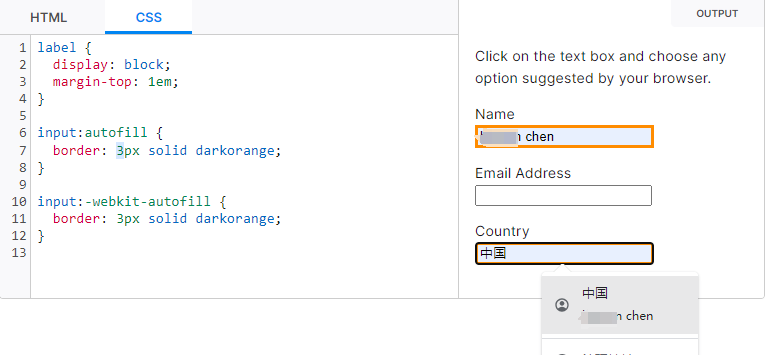
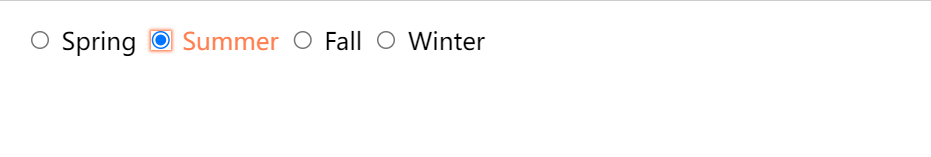
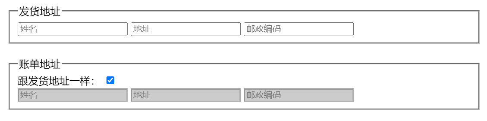
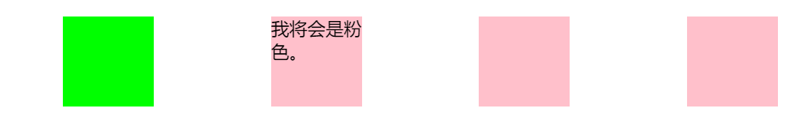
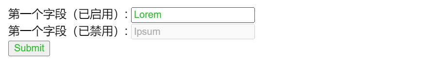
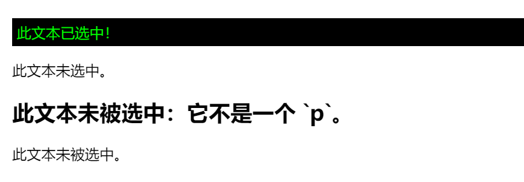
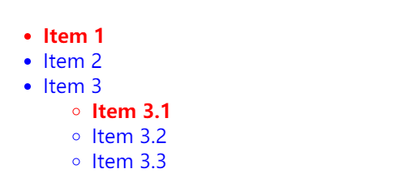
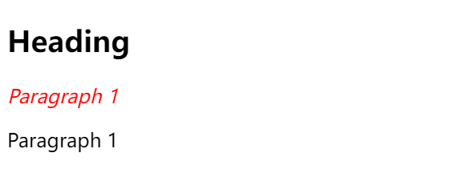
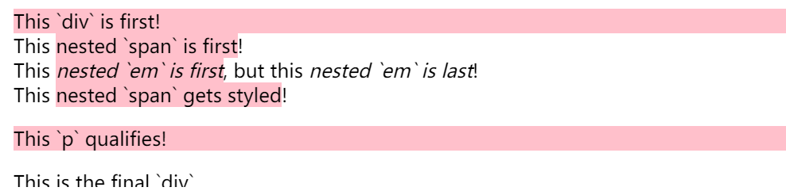

# 伪类

> <https://developer.mozilla.org/zh-CN/docs/Web/CSS/:active>
> 本文档最后更新日：2024年1月19日17:04:51

## 备忘录

类型|选择器 |描述|备注
--|--|--|--
[`:active`](#active)|在用户激活（例如点击）元素的时候匹配。|按下按键和松开按键之间的时间
`:hover`| 当用户悬浮到一个元素之上的时候匹配。
[`:any-link`](#any-link) |匹配一个链接的`:link`和`:visited`状态。|匹配每个具有 href 属性的 `<a>` 或 `<area>` 元素。
[`:autofill`](#autofill)|浏览器自动填充表单中的 `<input>` 元素的值时匹配该 input 元素。|当鼠标聚焦自动填充值时，未点击选则填充值时。
~~`:blank`~~|~~匹配空输入值的`<input>`元素。~~|~~各游览器未实现~~
[`:checked`](#checked) |匹配处于选中状态的单选或者复选框。|勾选/选中的 radio(单选按钮),checkbox(复选框),或者 option(select 中的一项)
~~`:current`~~ (en-US) |匹配正在展示的元素，或者其上级元素。|有风险 不推荐用 兼容性差
[`:default`](#default) |匹配一组相似的元素中默认的一个或者更多的 UI 元素。
[`:dir()`](#dir) |基于其方向性（HTMLdir属性或者 CSSdirection属性的值）匹配一个元素。|实验性，2023-12-05后谷歌游览器120版本实现;html中`<div dir="rtl">`=css属性`direction: rtl;`
操作|[`:disabled`](#disabled) |匹配处于关闭状态的用户界面元素| 不能被选中，激活，获取焦点时
|^|[`:enabled`](#enabled) |匹配处于开启状态的用户界面元素。|能操作的元素
^|[`:focus`](#focus)| 当一个元素有焦点的时候匹配。|获取焦点的时候
^|`:read-only` |匹配用户不可更改的元素。
^|`:read-write` |匹配用户可更改的元素。
`:valid` |匹配诸如`<input>`元素的处于可用状态的元素。
[`:empty`](#empty) |匹配除了可能存在的空格外，没有子元素的元素。|不包含任何子元素的元素。子元素可以是元素节点、标签或文本（包括空格、回车），以下可用`<div><!-- 注释不算--></div>` `<div></div>`
打印|`:first`| 匹配分页媒体的第一页。|与 `@page at 规则`一起使用。表示打印文档的第一页。`@page :first {}`
[`:first-child`](#first-child) |匹配兄弟元素中的第一个元素。|第一个元素
[`:first-of-type`](#first-of-type) |匹配兄弟元素中第一个某种类型的元素。|第一个类型
`:last-child`| 匹配兄弟元素中最末的那个元素。
`:last-of-type` |匹配兄弟元素中最后一个某种类型的元素。
`:only-child` |匹配没有兄弟元素的元素。
`:only-of-type` |匹配兄弟元素中某类型仅有的元素。
`:focus-visible`| 当元素有焦点，且焦点对用户可见的时候匹配。|
`:focus-within` |匹配有焦点的元素，以及子代元素有焦点的元素。
`:future` (en-US) |匹配当前元素之后的元素。
`:indeterminate`|匹配未定态值的 UI 元素，通常为复选框。
`:in-range` |用一个区间匹配元素，当值处于区间之内时匹配。
`:invalid`| 匹配诸如`<input>`的位于不可用状态的元素。
`:lang`|基于语言（HTMLlang属性的值）匹配元素。
`:left` |在分页媒体中，匹配左手边的页。
`:link` |匹配未曾访问的链接。
`:local-link` (en-US) |匹配指向和当前文档同一网站页面的链接。
`:is()` |匹配传入的选择器列表中的任何选择器。
`:not` |匹配作为值传入自身的选择器未匹配的物件。
`:nth-child` |匹配一列兄弟元素中的元素——兄弟元素按照an+b形式的式子进行匹配（比如 2n+1 匹配元素 1、3、5、7 等。即所有的奇数个）。
`:nth-of-type` |匹配某种类型的一列兄弟元素（比如，`<p>`元素）——兄弟元素按照an+b形式的式子进行匹配（比如 2n+1 匹配元素 1、3、5、7 等。即所有的奇数个）。
`:nth-last-child`|匹配一列兄弟元素，从后往前倒数。兄弟元素按照an+b形式的式子进行匹配（比如 2n+1 匹配按照顺序来的最后一个元素，然后往前两个，再往前两个，诸如此类。从后往前数的所有奇数个）。
`:nth-last-of-type` |匹配某种类型的一列兄弟元素（比如，`<p>`元素），从后往前倒数。兄弟元素按照an+b形式的式子进行匹配（比如 2n+1 匹配按照顺序来的最后一个元素，然后往前两个，再往前两个，诸如此类。从后往前数的所有奇数个）。
`:optional` |匹配不是必填的 form 元素。
`:required` |匹配必填的 form 元素。
`:out-of-range` |按区间匹配元素，当值不在区间内的的时候匹配。
`:past` (en-US) |匹配当前元素之前的元素。
`:placeholder-shown`| 匹配显示占位文字的 `input` 元素。
`:playing` |匹配代表音频、视频或者相似的能“播放”或者“暂停”的资源的，且正在“播放”的元素。
`:paused`| 匹配代表音频、视频或者相似的能“播放”或者“暂停”的资源的，且正在“暂停”的元素。
`:right` |在分页媒体中，匹配右手边的页。
`:root` |匹配文档的根元素。
`:scope`| 匹配任何为参考点元素的的元素。
`:target` |匹配当前 URL 目标的元素（例如如果它有一个匹配当前URL 分段的元素）。
`:visited` |匹配已访问链接。

## :active

用户按下按键和松开按键之间的时间

在有多键鼠标的系统中，CSS 3 规定 :active 伪类必须只匹配主按键；对于右手操作鼠标来说，就是左键。

```css
a:link {
  /* 未访问链接 */
  color: blue;
}
a:visited {
  /* 已访问链接 */
  color: purple;
}
a:hover {
  /* 用户鼠标悬停 */
  background: yellow;
}
a:active {
  /* 激活链接 */
  color: red;
}

p:active {
  /* 激活段落 */
  background: #eee;
}
```

## :any-link

> `:any-link` CSS 伪类选择器表示作为超链接源锚点的元素，无论是否已被访问。换言之，它匹配每个具有 href 属性的 `<a>`或 `<area>` 元素。因此，它匹配所有匹配 `:link` 或 `:visited` 的元素。

## :autofill

`:autofill` CSS 伪类将在浏览器自动填充表单中的 `<input>` 元素的值时匹配该 input 元素。如果用户编辑了该字段，则该类将不再匹配。

备注： 许多浏览器的用户代理样式表在其 `:-webkit-autofill` 样式声明中使用 `!important`，使它们无法被网页覆盖，除非通过 JavaScript 的方式。例如，Chrome 在其内部样式表中有以下内容：

```CSS
background-color: rgb(232, 240, 254) !important;
background-image: none !important;
color: -internal-light-dark(black, white) !important;
```

这意味着你无法在自己的样式规则中设置 `background-color`、`background-image` 或 `color` 等属性。

例子

```html
<form>
  <p>Click on the text box and choose any option suggested by your browser.</p>

  <label for="name">Name</label>
  <input name="name" type="text" autocomplete="name" />

  <label for="email">Email Address</label>
  <input name="email" type="email" autocomplete="email" />

  <label for="country">Country</label>
  <input name="country" type="text" autocomplete="country-name" />
</form>
```

```css
label {
  display: block;
  margin-top: 1em;
}

input:autofill {
  border: 3px solid darkorange;
}

input:-webkit-autofill {
  border: 3px solid darkorange;
}
```



## :checked

:checked CSS 伪类选择器表示任何处于选中状态的radio(`<input type="radio">`), checkbox (`<input type="checkbox">`) 或 ("select") 元素中的option HTML 元素 ("option")。

```CSS
/* 匹配任意被勾选/选中的 radio(单选按钮),checkbox(复选框),或者 option(select 中的一项) */
:checked {
  margin-left: 25px;
  border: 1px solid blue;
}
```

用户通过勾选/选中元素或取消勾选/取消选中，来改变该元素的 :checked 状态。

```css
/* Labels for checked inputs */
input:checked + label {
  color: red;
}

/* Radio element, when checked */
input[type="radio"]:checked {
  box-shadow: 0 0 0 3px orange;
}

/* Checkbox element, when checked */
input[type="checkbox"]:checked {
  box-shadow: 0 0 0 3px hotpink;
}

/* Option elements, when selected */
option:checked {
  box-shadow: 0 0 0 3px lime;
  color: red;
}
```

**借用隐藏的 checkbox 来切换元素的样式（显示/隐藏）**  
这个例子利用了:checked伪类，让用户基于复选框的状态切换内容，而无需使用 JavaScript。

```html
<input type="checkbox" id="expand-toggle" />

<table>
  <thead>
    <tr>
      <th>Column #1</th>
      <th>Column #2</th>
      <th>Column #3</th>
    </tr>
  </thead>
  <tbody>
    <tr class="expandable">
      <td>[more text]</td>
      <td>[more text]</td>
      <td>[more text]</td>
    </tr>
    <tr>
      <td>[cell text]</td>
      <td>[cell text]</td>
      <td>[cell text]</td>
    </tr>
    <tr>
      <td>[cell text]</td>
      <td>[cell text]</td>
      <td>[cell text]</td>
    </tr>
    <tr class="expandable">
      <td>[more text]</td>
      <td>[more text]</td>
      <td>[more text]</td>
    </tr>
    <tr class="expandable">
      <td>[more text]</td>
      <td>[more text]</td>
      <td>[more text]</td>
    </tr>
  </tbody>
</table>

<label for="expand-toggle" id="expand-btn">Toggle hidden rows</label>
```

```css
/* Hide the toggle checkbox */
#expand-toggle {
  display: none;
}

/* Hide expandable content by default */
.expandable {
  visibility: collapse;
  background: #ddd;
}

/* Style the button */
#expand-btn {
  display: inline-block;
  margin-top: 12px;
  padding: 5px 11px;
  background-color: #ff7;
  border: 1px solid;
  border-radius: 3px;
}

/* Show hidden content when the checkbox is checked */
#expand-toggle:checked ~ * .expandable {
  visibility: visible;
}

/* Style the button when the checkbox is checked */
#expand-toggle:checked ~ #expand-btn {
  background-color: #ccc;
}
```

## :default

:default CSS pseudo-class 表示一组相关元素中的默认表单元素。

该选择器可以在 `<button>`, `<input type="checkbox">`, `<input type="radio">`, 以及 `<option>` 上使用。

```CSS
/* Selects any default <input> */
input:default {
  background-color: lime;
}
```

允许多个选择的分组元素也可以具有多个默认值，即，它们可以具有最初选择的多个项目。在这种情况下，所有默认值都使用 :default 伪类表示。例如，你可以在一组复选框之间设置默认复选框。

示例

```HTML
<input type="radio" name="season" id="spring" />
<label for="spring">Spring</label>

<input type="radio" name="season" id="summer" checked />
<label for="summer">Summer</label>

<input type="radio" name="season" id="fall" />
<label for="fall">Fall</label>

<input type="radio" name="season" id="winter" />
<label for="winter">Winter</label>
```

```CSS
input:default {
  box-shadow: 0 0 2px 1px coral;
}

input:default + label {
  color: coral;
}
```

结果


## :dir()

**实验性: 这是一项实验性技术**
在将其用于生产之前，请仔细检查浏览器兼容性表格。

总结
:dir()伪类匹配特定文字书写方向的元素。在 HTML 中，文字方向由dir属性决定。其他的文档类型可能有其他定义文字方向的方法。

值得注意的是用 CSS 伪类 :dir() 并不等于使用 `[dir=…]` 属性选择器。后者匹配 dir 的值且不会匹配到未定义此属性的元素，即使该元素继承了父元素的属性；类似的， `[dir=rtl]` 或 `[dir=ltr]` 不会匹配到 dir 属性的值为 auto 的元素。而 :dir()会匹配经过客户端计算后的属性，不管是继承的 dir 值还是 dir 值为 auto 的。

另外，`:dir()` 伪类仅考虑文档（大多数情况是 HTML）中定义的文字方向的语义值 (semantic value)，并不会考虑格式值 (styling value)，如 CSS 属性 `direction` 的值。

语法
`元素:dir(文字书写方向) { style properties } 文字书写方向为 ltr 或 rtl`
示例

```HTML

<div dir="rtl">
  <span>test1</span>
  <div dir="ltr">
    test2
    <div dir="auto">עִבְרִית</div>
  </div>
</div>
```

本例中 `:dir(rtl)` 会匹配最外层的 `div`，内容为test1 的 `span`，和有希伯来字符的 `div`。`:dir(ltr)` 会匹配到内容为test2 的 `div`.

## :disabled

`:disabled` CSS 伪类表示任何被禁用的元素。如果一个元素不能被激活（如选择、点击或接受文本输入）或获取焦点，则该元素处于被禁用状态。元素还有一个启用状态，在启用状态下，元素可以被激活或获取焦点。

示例
这个例子展示了一个基本的发货表单。通过使用 JavaScript change 事件让用户启用/禁用账单字段。

```HTML
<form action="#">
  <fieldset id="shipping">
    <legend>发货地址</legend>
    <input type="text" placeholder="姓名" />
    <input type="text" placeholder="地址" />
    <input type="text" placeholder="邮政编码" />
  </fieldset>
  <br />
  <fieldset id="billing">
    <legend>账单地址</legend>
    <label for="billing-checkbox">跟发货地址一样：</label>
    <input type="checkbox" id="billing-checkbox" checked />
    <br />
    <input type="text" placeholder="姓名" disabled />
    <input type="text" placeholder="地址" disabled />
    <input type="text" placeholder="邮政编码" disabled />
  </fieldset>
</form>
```

```CSS
input[type="text"]:disabled {
  background: #ccc;
}
```

```JavaScript
// 等待页面加载完毕
document.addEventListener(
  "DOMContentLoaded",
  function () {
    // 将“change”事件监听器附加到复选框
    document.getElementById("billing-checkbox").onchange = toggleBilling;
  },
  false,
);

function toggleBilling() {
  // 选择 billing 文本字段
  var billingItems = document.querySelectorAll('#billing input[type="text"]');

  // 切换 billing 文本字段
  for (var i = 0; i < billingItems.length; i++) {
    billingItems[i].disabled = !billingItems[i].disabled;
  }
}
```

结果


## :empty

:empty CSS 伪类用于选择不包含任何子元素的元素。子元素可以是元素节点或文本（包括空格）。但是注释、处理指令和 CSS content 不会影响元素是否被认定为空。

示例

```HTML
<div class="box"><!-- 它将呈现为青柠色。 --></div>
<div class="box">我将会是粉色。</div>
<div class="box">
  <!-- 由于这个注释周围存在空格，所以它将在旧版本的浏览器中呈现为粉色。 -->
</div>
<div class="box">
  <p>
    <!-- 由于这个注释周围存在无法折叠的空格和元素，所以它将在所有浏览器中呈现为粉色。 -->
  </p>
</div>
```

```CSS
.box {
  background: pink;
  height: 80px;
  width: 80px;
}

.box:empty {
  background: lime;
}
```

结果


## :enabled

`:enabled` CSS 伪类表示任何已启用的元素。如果元素可以被激活（例如被选择、单击、输入文本等），或者能够获得焦点，那么它就是启用的。该元素还有一个被禁用的状态，在此状态下它无法被激活或接受焦点。

**示例**
以下示例将在启用状态下把类型为文本输入框和按钮的 `<input>` 颜色设置为绿色，禁用时设置为灰色。这有助于用户理解哪些元素可以进行交互操作。

```HTML
<form action="url_of_form">
  <label for="FirstField">第一个字段（已启用）:</label>
  <input type="text" id="FirstField" value="Lorem" /><br />

  <label for="SecondField">第一个字段（已禁用）:</label>
  <input type="text" id="SecondField" value="Ipsum" disabled="disabled" /><br />

  <input type="button" value="Submit" />
</form>
```

```CSS
input:enabled {
  color: #2b2;
}

input:disabled {
  color: #aaa;
}
```

结果



## :first

`:first` CSS 伪类与 @page at 规则一起使用。表示打印文档的第一页。（有关节点的第一个元素，请参阅 `:first-child`。）

```CSS
/* 打印时选择第一页 */
@page :first {
  margin-left: 50%;
  margin-top: 50%;
}
```

备注： 你不能使用此伪类更改所有的 CSS 属性。你只能更改文档的边距、orphans (en-US)、widows 和分页符。此外，在定义边距时，你只能使用绝对长度单位。所有其他属性都将被忽略。

语法

```CSS
:first {
  /* ... */
}
```

示例

```HTML
<p>第一页。</p>
<p>第二页。</p>
<button>打印！</button>
```

```CSS
@page :first {
  margin-left: 50%;
  margin-top: 50%;
}

p {
  page-break-after: always;
}
```

```JavaScript
document.querySelector("button").addEventListener("click", () => {
  window.print();
});
```

结果

按下“打印！”按钮以打印此示例。**第一页的文字应该大致位于中心位置，而其他页的内容将位于默认位置。**

## :first-child

`:first-child`CSS 伪类表示在一组兄弟元素中的第一个元素。

示例

```HTML
<div>
  <p>此文本已选中！</p>
  <p>此文本未选中。</p>
</div>

<div>
  <h2>此文本未被选中：它不是一个 `p`。</h2>
  <p>此文本未被选中。</p>
</div>
```

```CSS
p:first-child {
  color: lime;
  background-color: black;
  padding: 5px;
}
```

结果


样式化列表

```HTML
<ul>
  <li>Item 1</li>
  <li>Item 2</li>
  <li>
    Item 3
    <ul>
      <li>Item 3.1</li>
      <li>Item 3.2</li>
      <li>Item 3.3</li>
    </ul>
  </li>
</ul>
```

```CSS
ul li {
  color: blue;
}

ul li:first-child {
  color: red;
  font-weight: bold;
}
```

结果


## :first-of-type

CSS 伪类 :first-of-type 表示一组兄弟元素中其类型的第一个元素。

示例
装饰第一个段落

```HTML
<h2>Heading</h2>
<p>Paragraph 1</p>
<p>Paragraph 1</p>
```

```CSS
p:first-of-type {
  color: red;
  font-style: italic;
}
```

结果


嵌套元素
下面这个例子展示了如何选中多层嵌套元素。注意当不存在简单选择器时，通配符（*）是默认应用的。

```HTML
<article>
  <div>This `div` is first!</div>
  <div>This <span>nested `span` is first</span>!</div>
  <div>
    This <em>nested `em` is first</em>, but this <em>nested `em` is last</em>!
  </div>
  <div>This <span>nested `span` gets styled</span>!</div>
  <p>This `p` qualifies!</p>
  <div>This is the final `div`.</div>
</article>
```

```CSS
article :first-of-type {
  background-color: pink;
}
```

结果


## :focus

`:focus` CSS 伪类表示获得焦点的元素（如表单输入）。当用户点击或轻触一个元素或使用键盘的 Tab 键选择它时，它会被触发。

备注： 此伪类仅适用于焦点的元素自身。如果要选择包含焦点元素的元素，请使用 `:focus-within`。

示例

```HTML
<div><input class="red-input" value="当获得焦点时我将呈现红色。" /></div>
<div><input class="blue-input" value="当获得焦点时我将呈现蓝色。" /></div>
```

```CSS
.red-input:focus {
  background: yellow;
  color: red;
}

.blue-input:focus {
  background: yellow;
  color: blue;
}
```

## :focus-visible

当元素匹配`:focus`伪类并且客户端 (UA) 的启发式引擎决定焦点应当可见 (在这种情况下很多浏览器默认显示“焦点框”。) 时，`:focus-visible` 伪类将生效。

这个选择器可以有效地根据用户的输入方式 (鼠标 vs 键盘) 展示不同形式的焦点。

请注意 Firefox 通过较旧的前缀伪类 `:-moz-focusring` 支持类似的功能。

语法

```CSS
:focus-visible {
  /* ... */
}
```

示例
基本示例
在这个例子中，`:focus-visible` 选择器利用客户端 (UA) 的行为决定是否匹配。比较一下，当你用鼠标点击控件和用键盘 tab 切换控件有何不同。请注意元素的表现与具有 `:focus` 样式的元素的区别。

```HTML
<input value="Default styles" /><br />
<button>Default styles</button><br />
<input class="focus-only" value=":focus only" /><br />
<button class="focus-only">:focus only</button><br />
<input class="focus-visible-only" value=":focus-visible only" /><br />
<button class="focus-visible-only">:focus-visible only</button>
```

```CSS
input,
button {
  margin: 10px;
}

.focus-only:focus {
  outline: 2px solid black;
}

.focus-visible-only:focus-visible {
  outline: 4px dashed darkorange;
}
```

选择性地显示焦点
自定义控件，比如按钮自定义元素，可以使用 :focus-visible 使其仅在键盘操作时才显示焦点样式。这和`<button>`一类的原生控件表现一致。

```HTML
<custom-button tabindex="0" role="button">Click Me</custom-button>
```

```CSS
custom-button {
  display: inline-block;
  margin: 10px;
}

custom-button:focus {
  /* Provide a fallback style for browsers
     that don't support :focus-visible */
  outline: none;
  background: lightgrey;
}

custom-button:focus:not(:focus-visible) {
  /* Remove the focus indicator on mouse-focus for browsers
     that do support :focus-visible */
  background: transparent;
}

custom-button:focus-visible {
  /* Draw a very noticeable focus style for
     keyboard-focus on browsers that do support
     :focus-visible */
  outline: 4px dashed darkorange;
  background: transparent;
}
```

多边形

你可以使用 `:focus-visible` 的 polyfill focus-visible.js 。
