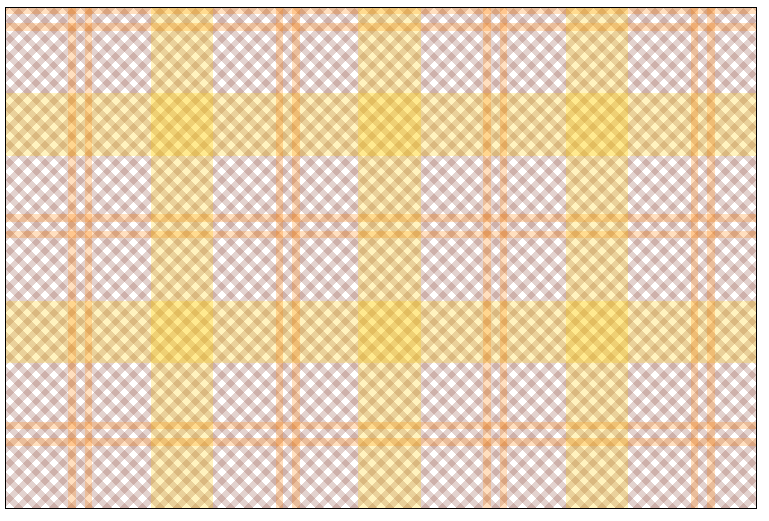
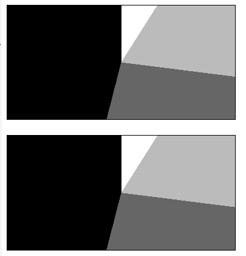

# 背景色渐变

## 语法

### 线性渐变

线性渐变会在一个假想的直线上过渡颜色。线性渐变是由 [linear-gradient()](#线性渐变-linear-gradient) 函数产生的。

由于 `<gradient>` 属于 `<image>` 数据类型，因此只能用在能使用 `<image>` 的地方。因此，`linear-gradient()` 在 `background-color` 以及其他使用 `<color>` 数据类型的属性上**不起作用**。

```css
.linear-gradient {
  background: linear-gradient(
    to right,
    red,
    orange,
    yellow,
    green,
    blue,
    indigo,
    violet
  );
}
```


### 径向渐变（圆形/椭圆）

径向渐变从一个中间点（原点）开始过渡颜色。径向渐变是由 [radial-gradient()](#径向渐变-radial-gradient) 函数产生的。

```css
.radial-gradient {
  background: radial-gradient(red, yellow, rgb(30, 144, 255));
}
```


### 重复渐变

重复渐变可根据需要复制渐变，以填充指定区域。重复渐变是使用 `repeating-linear-gradient()` 和 `repeating-radial-gradient()` 函数生成的。

```css
.linear-repeat {
  background: repeating-linear-gradient(
    to top left,
    lightpink,
    lightpink 5px,
    white 5px,
    white 10px
  );
}

.radial-repeat {
  background: repeating-radial-gradient(
    powderblue,
    powderblue 8px,
    white 8px,
    white 16px
  );
}
```


### 锥形渐变

锥形渐变会沿着一个圆过渡颜色。锥形渐变是由 `conic-gradient()` 函数产生的。

```css
.conic-gradient {
  background: conic-gradient(lightpink, white, powderblue);
}
```


## 线性渐变 linear-gradient()

案例模板：[线性渐变.html](Code/渐变色/线性渐变.html)

由两种或多种颜色沿一条直线进行线性过渡的图像

要创建一个能够重复填满容器的线性渐变，请使用 repeating-linear-gradient() 函数。

```css
/* 渐变轴为 45 度，从蓝色渐变到红色 */
linear-gradient(45deg, blue, red);

/* 从右下到左上、从蓝色渐变到红色 */
linear-gradient(to left top, blue, red);

/* 色标：从下到上，从蓝色开始渐变，到高度 40% 位置是绿色渐变开始，最后以红色结束 */
linear-gradient(0deg, blue, green 40%, red);

/* 颜色提示：从左到右的渐变，由红色开始，沿着渐变长度到 10% 的位置，然后在剩余的 90% 长度中变成蓝色 */
linear-gradient(.25turn, red, 10%, blue);

/* 多位置色标：45% 倾斜的渐变，左下半部分为红色，右下半部分为蓝色，中间有一条硬线，在这里渐变由红色转变为蓝色 */
linear-gradient(45deg, red 0 50%, blue 50% 100%);
```


### 线性渐变：值

#### 渐变线的起始点位置

渐变线的起始点位置。如果指定了，则包含 `to` 和最多两个关键字：一个指定水平位置（`left` 或 `right`），另一个指定竖直位置（`top` 或 `bottom`）。关键词的先后顺序无影响。如果没有指定，则默认为 `to bottom`。 `to top`、`to bottom`、`to left` 和 `to right` 分别等价于 `0deg`、`180deg`、`270deg` 和 `90deg`。其余值会被转换为角度。

#### 渐变线的方向的角度

渐变线的方向的角度。`0deg` 等价于 `to top`，增加值相当于顺时针旋转。

#### 线性渐变：色标

色标（color stop）的 `<color>` 值，然后是一个或两个可选的色标位置（沿渐变轴的 `<percentage>` 值或 `<length>` 值）。

#### 插值提示

插值提示，定义渐变色在相邻色标之间的渐变过程。其中的长度定义了渐变色应在两个色标之间的哪个点到达颜色过渡的中点。如果省略该值，颜色过渡的中点就是两个色标之间的中点。

### 线性渐变的合成

线性渐变是在一个轴——渐变线和两个或者更多个色标构成的。轴上的每个点都是一个单独的颜色，要创建平滑的渐变，`linear-gradient()` 函数会绘制出一系列与渐变线垂直的彩色线，每条线都匹配与渐变线相交点的颜色。


渐变线由包含渐变图形的容器的中心点和一个角度来定义的。渐变线上的颜色值是由不同的点来定义，包括起始点、终点，以及两者之间的可选的中间点（中间点可以有多个）。

起点是渐变线上代表起始颜色值的点。终点是渐变线上代表最终颜色值的点。这两个点都是由渐变线和从最近的顶点发出的垂直线之间的交叉点定义的，然而从起点的对称点来定义终点是更容易理解的一种方式，因为终点是起点关于容器的中心点的反射点。这一复杂的定义导致了一个有趣的效果，有时称为 *magic corners*：起点附近的点具有跟起点相同的颜色值，终点附近的点具有跟终点相同的颜色值。

### 线性渐变：自定义变色

通过提供额外的色标，可以在多种颜色之间创建高度个性化的过渡效果。色标的位置可以由 `<length>` 值或 `<percentage>` 值清晰地指定。如果你不指定颜色的位置，那么将会位于前面和后面两点的中点。以下**两个渐变是等价**的：

```css
linear-gradient(red, orange, yellow, green, blue);
linear-gradient(red 0%, orange 25%, yellow 50%, green 75%, blue 100%);
```


默认情况下，颜色会从一个色标的颜色到后续的色标的颜色平滑过渡，颜色的中点是颜色过渡中的中间点。你可以将这个中点移动到两个色标之间的任何位置，方法就是在两个颜色之间的中点所在的位置添加一个没有加标签的 % 颜色提示。下面这个例子中，起始点到 10% 是纯红色，90% 到结束点是纯蓝色。10% 和 90% 之间是颜色从红色过渡到蓝色的地方，但是，过渡的中点是 30% 的位置，假如没有这个 30% 的颜色提示，就会是 50% 的位置。

```css
linear-gradient(red 10%, 30%, blue 90%);
```


如果两个及以上色标位于同一个位置，那么过渡会在这个位置的第一个和最后一个颜色之间产生一条硬线。

色标应该以递增的顺序列出。后面的更低值的色标会覆盖前面的值并创建硬过渡线。下面的渐变在 40% 处由红色变为黄色，然后在 25% 处由黄色变为蓝色：

```css
linear-gradient(red 40%, yellow 30%, blue 65%);
```


允许有多个位置的色标。一个颜色可以声明为多个相邻的色标，方法就是在 CSS 声明中包括这两个位置。以下的三个渐变是等价的：

```CSS
linear-gradient(red 0%, orange 10%, orange 30%, yellow 50%, yellow 70%, green 90%, green 100%);
linear-gradient(red, orange 10% 30%, yellow 50% 70%, green 90%);
linear-gradient(red 0%, orange 10% 30%, yellow 50% 70%, green 90% 100%);
```


默认情况下，如果 0% 的地方没有颜色，那么那里就是声明的第一个颜色。类似地，最后一个颜色也会持续到 100% 的位置，或者如果最后一个色标没有声明长度，那么就是在 100% 的位置。

### 线性渐变：示例

#### 45 度渐变

```CSS
body {
  background: linear-gradient(45deg, red, blue);
}
```


#### 从渐变线 60% 处开始的渐变

```CSS
body {
  background: linear-gradient(135deg, orange 60%, cyan);
}
```


#### 有多位置色标的渐变

这个示例使用了多位置的色标，两个相邻的颜色有相同的色标值，形成了条纹效果。

```CSS
body {
  background: linear-gradient(
    to right,
    red 20%,
    orange 20% 40%,
    yellow 40% 60%,
    green 60% 80%,
    blue 80%
  );
}
```


#### 堆叠渐变

你可以将渐变与其他的渐变堆叠起来。只要顶部的渐变不是完全不透明的，那么下面的渐变就会依然可见。

```CSS
.stacked-linear {
  background: linear-gradient(
      217deg,
      rgba(255, 0, 0, 0.8),
      rgba(255, 0, 0, 0) 70.71%
    ), linear-gradient(127deg, rgba(0, 255, 0, 0.8), rgba(0, 255, 0, 0) 70.71%),
    linear-gradient(336deg, rgba(0, 0, 255, 0.8), rgba(0, 0, 255, 0) 70.71%);
}
```


---

## 径向渐变 radial-gradient()

```css
/* 在容器中心的渐变，从红色开始，变成蓝色，最后变成绿色 */
radial-gradient(circle at center, red 0, blue, green 100%)
```

.png)

### 径向渐变：值

#### 渐变的位置

和解析 [background-position](06.3-背景图片的定位.md) 或者 `transform-origin` 的方式相同。如果没有指定，默认为 center。

```css
/* 一个值的语法：关键字 center、top、left、bottom、right */
background-position: top;
background-position: bottom;
background-position: left;
background-position: right;
background-position: center;

/* <percentage> values */
/* 一个定义 x 坐标，另一个定义 y 坐标 */
background-position: 25% 75%;

/* <length> values */
background-position: 0 0;
background-position: 1cm 2cm;
background-position: 10ch 8em;

/* Multiple images */
background-position:
  0 0,
  center;

/* Edge offsets values */
background-position: bottom 10px right 20px;
background-position: right 3em bottom 10px;
background-position: bottom 10px right;
background-position: top right 10px;

```

#### 渐变的结束形状

- circle（圆形，渐变的形状是一个半径不变的正圆）
- ellipse（椭圆，渐变形状是轴对称椭圆）。
- 如果没有指定，默认为 ellipse。

#### 确定渐变结束形状的大小

- 如果省略，则默认为最远角（farthest-corner）。它可以显式给出，也可以通过关键字给出。
- 就关键字定义而言，渐变框边缘应视为向两个方向无限延伸，而不是有限线段。
- 对于它们的 大小，圆形和椭圆渐变都接受以下关键字：
  - `losest-side` 渐变结束形状如果是圆形，与容器距离渐变中心点最近的一边相切，如果是椭圆，则与距离渐变中心点最近的垂直和水平边相切。
  - `closest-corner` 渐变结束形状与容器距离渐变中心点最近的一个角相交。
  - `farthest-side` 类似于 closest-side，但是结束形状与容器距离渐变中心点最远的一边（或最远的垂直和水平边）相切。
  - `farthest-corner` 默认值，渐变的结束形状与容器距离渐变中心点最远的一个角相交。
- 如果 结束形状 被指定为 `circle`，则可以为大小指定一个 长度 值，它明确了圆的半径。负值是无效的。
- 如果 结束形状 被指定为 `ellipse`，则可以使用带有两个值的 长度或百分比 来指定椭圆的大小。第一个值表示水平半径，第二个值表示垂直半径。百分比值是相对于渐变框在相应维度上的大小的。负值是无效的。
- 如果 结束形状 关键词被省略，渐变形状会由给定的大小决定。一个 长度 产生圆，两个 长度或百分比 单位的值产生椭圆。一个 百分比 值是无效的。

#### 径向渐变：色标

色标（color stop）的 `<color>` 值，然后是一个或两个可选的色标位置（沿渐变轴的 百分比 或 长度）。

- 百分比值 0%，或者长度值 0，代表渐变的中心；
- 值 100% 表示结束形状与虚拟渐变射线的交点。
- 两者之间的百分比值线性定位在渐变射线上。
- 包含两个色标位置相当于在两个位置上声明了两个颜色相同的色标。

#### 颜色提示

颜色提示（color-hint）是一个插值提示，定义了渐变色在相邻色标之间的渐变方式。这个长度定义了渐变色应在两个色标之间的哪个点到达颜色过渡的中点。如果省略该值，颜色过渡的中点就是两个色标之间的中点。

### 径向渐变的合成


*径向渐变由其中心点、结束形状轮廓、两个及以上色标*定义而成。

要创建平滑的渐变，`radial-gradient()` 函数绘制了一系列从中心点放射到结束形状（甚至可能超出范围）的同心轮廓。结束形状可以是圆形或椭圆形。

色标位于虚拟渐变射线（virtual gradient ray）上，该渐变射线从中心点水平向右延伸。基于百分比的色标位置是相对于结束形状和此渐变射线之间的交点（代表 `100%`）。每个形状都是单个颜色，并由其相交的渐变射线上的颜色确定。

### 径向渐变:示例

#### 简单的渐变

```CSS
.radial-gradient {
  background-image: radial-gradient(cyan 0%, transparent 20%, salmon 40%);
}
```


#### 非居中渐变

```CSS
.radial-gradient {
  background-image: radial-gradient(
    farthest-corner at 40px 40px,
    #f35 0%,
    #43e 100%
  );
}
```


#### 设置渐变的中心

你可以使用关键字、百分比或者绝对长度、长度和百分比值的重复（如果存在，否则就是从左侧位置和顶部位置开始的）以指定渐变的中心。

```css
.radial-gradient {
    background: radial-gradient(at 0% 0%, red 10px, yellow 30%, #1e90ff 50%);
}
```


#### 设置径向渐变的大小

和线性渐变不同，你可以指定径向渐变的大小。可能的值包括 `closest-corner`、`closest-side`、`farthest-corner` 和 `farthest-side`，其中 `farthest-corner` 是默认值。圆的大小为长度，椭圆则是长度和百分比。

##### 椭圆渐变的 closet-side 值

这个例子使用了 `closest-side` 大小值，意思就是大小是通过开始点（中心）和包围盒的最近一侧的距离设置的。

```css
.radial-ellipse-side {
  background: radial-gradient(
    ellipse closest-side,
    red,
    yellow 10%,
    #1e90ff 50%,
    beige
  );
}
```


##### 椭圆渐变的 farthest-corner 值

这个例子和前一个类似，但是其大小是以 `farthest-corner` 指定的，这会将渐变的大小设置为从开始点到包围盒的距离开始点的最远角的距离设置的。

```css
.radial-ellipse-far {
  background: radial-gradient(
    ellipse farthest-corner at 90% 90%,
    red,
    yellow 10%,
    #1e90ff 50%,
    beige
  );
}
```


##### 圆形渐变的 closet-side 值

这个例子使用了 closest-side，使得圆的半径是渐变中心到最近一侧的距离。在这个例子中，半径是中心到底部的距离，因为渐变位于左侧 25%、底部 25% 的位置，而 div 元素的高度小于宽度。

```css
.radial-circle-close {
  background: radial-gradient(
    circle closest-side at 25% 75%,
    red,
    yellow 10%,
    #1e90ff 50%,
    beige
  );
}
```


##### 椭圆形渐变长度或百分比

对于椭圆，你可以使用长度或者百分比来设置其大小，第一个值代表了水平半径，第二个值是竖直半径，你可以使用百分比以表示相对于盒在那个维度上的大小的值。在下面这个例子中，我使用了百分比以表示水平半径。

```css
.radial-ellipse-size {
  background: radial-gradient(
    ellipse 50% 50px,
    red,
    yellow 10%,
    #1e90ff 50%,
    beige
  );
}
```


##### 圆形渐变的长度

```css
.radial-circle-size {
  background: radial-gradient(circle 50px, red, yellow 10%, #1e90ff 50%, beige);
}
```


#### 堆叠径向渐变

```css
.stacked-radial {
  background:
    radial-gradient(
      circle at 50% 0,
      rgba(255, 0, 0, 0.5),
      rgba(255, 0, 0, 0) 70.71%
    ),
    radial-gradient(
      circle at 6.7% 75%,
      rgba(0, 0, 255, 0.5),
      rgba(0, 0, 255, 0) 70.71%
    ),
    radial-gradient(
        circle at 93.3% 75%,
        rgba(0, 255, 0, 0.5),
        rgba(0, 255, 0, 0) 70.71%
      ) beige;
  border-radius: 50%;
}

```


---

## 重复线性渐变 repeating-linear-gradient()

代码：[重复线性渐变.html](Code/渐变色/重复线性渐变.html)

创建一个由重复线性渐变组成的 `<image>`，类似于 [linear-gradient()](#线性渐变-linear-gradient) ，并且采用相同的参数，但是它会在所有方向上重复渐变以覆盖其整个容器。

**重复渐变的长度是第一个色标和最后一个色标之间的距离。** 如果第一种颜色没有色标长度，则色标长度默认为 0。每次重复时，色标的位置都会以基本线性渐变长度的倍数移动。因此，每个结束色标的位置都会与起始色标的位置重合；如果色值不同，就会产生鲜明的视觉过渡。可以通过重复第一种颜色值作为最后一种颜色值来改变这种情况。

与其他渐变一样，线性重复渐变没有内在尺寸，也就是说，它没有固有或首选的尺寸，也没有首选的比例，其实际大小取决于所应用的元素的大小。

由于 `<gradient>` 属于 `<image>` 数据类型，因此只能用在可以使用 `<image>` 的地方。因此，`repeating-linear-gradient()` 在`background-color` 以及其他使用 `<color>` 数据类型上不起作用。

```css
/* 一个倾斜 45 度的重复线性渐变，
   从蓝色开始渐变到红色 */
repeating-linear-gradient(45deg, blue, red);

/* 一个从右下角到左上角的重复线性渐变，
   从蓝色开始渐变到红色 */
repeating-linear-gradient(to left top, blue, red);

/* 一个由下至上的重复线性渐变，
   从蓝色开始，40% 后变绿，
   最后渐变到红色 */
repeating-linear-gradient(0deg, blue, green 40%, red);

/* 从左到右重复五次的渐变，从红色开始，然后变绿，再变回红色 */
repeating-linear-gradient(to right, red 0%, green 10%, red 20%);
```

### 重复线性渐变-示例

#### 斑马条纹

```css
body {
  background-image: repeating-linear-gradient(
    -45deg,
    transparent,
    transparent 20px,
    black 20px,
    black 40px
  );
  /* 包括多个色标长度 */
  background-image: repeating-linear-gradient(
    -45deg,
    transparent 0 20px,
    black 20px 40px
  );
}
```


#### 十个重复的水平线

```css
body {
  background-image: repeating-linear-gradient(
    to bottom,
    rgb(26, 198, 204),
    rgb(26, 198, 204) 7%,
    rgb(100, 100, 100) 10%
  );
}
```


#### 多个线性渐变

```css
.multi-repeating-linear {
  background: repeating-linear-gradient(
      190deg,
      rgba(255, 0, 0, 0.5) 40px,
      rgba(255, 153, 0, 0.5) 80px,
      rgba(255, 255, 0, 0.5) 120px,
      rgba(0, 255, 0, 0.5) 160px,
      rgba(0, 0, 255, 0.5) 200px,
      rgba(75, 0, 130, 0.5) 240px,
      rgba(238, 130, 238, 0.5) 280px,
      rgba(255, 0, 0, 0.5) 300px
    ), repeating-linear-gradient(
      -190deg,
      rgba(255, 0, 0, 0.5) 30px,
      rgba(255, 153, 0, 0.5) 60px,
      rgba(255, 255, 0, 0.5) 90px,
      rgba(0, 255, 0, 0.5) 120px,
      rgba(0, 0, 255, 0.5) 150px,
      rgba(75, 0, 130, 0.5) 180px,
      rgba(238, 130, 238, 0.5) 210px,
      rgba(255, 0, 0, 0.5) 230px
    ), repeating-linear-gradient(23deg, red 50px, orange 100px, yellow 150px, green
        200px, blue 250px, indigo 300px, violet 350px, red 370px);
}
```


#### 格纹渐变

```css
.plaid-gradient {
  background: repeating-linear-gradient(
      90deg,
      transparent,
      transparent 50px,
      rgba(255, 127, 0, 0.25) 50px,
      rgba(255, 127, 0, 0.25) 56px,
      transparent 56px,
      transparent 63px,
      rgba(255, 127, 0, 0.25) 63px,
      rgba(255, 127, 0, 0.25) 69px,
      transparent 69px,
      transparent 116px,
      rgba(255, 206, 0, 0.25) 116px,
      rgba(255, 206, 0, 0.25) 166px
    ), repeating-linear-gradient(
      0deg,
      transparent,
      transparent 50px,
      rgba(255, 127, 0, 0.25) 50px,
      rgba(255, 127, 0, 0.25) 56px,
      transparent 56px,
      transparent 63px,
      rgba(255, 127, 0, 0.25) 63px,
      rgba(255, 127, 0, 0.25) 69px,
      transparent 69px,
      transparent 116px,
      rgba(255, 206, 0, 0.25) 116px,
      rgba(255, 206, 0, 0.25) 166px
    ), repeating-linear-gradient(
      -45deg,
      transparent,
      transparent 5px,
      rgba(143, 77, 63, 0.25) 5px,
      rgba(143, 77, 63, 0.25) 10px
    ), repeating-linear-gradient(45deg, transparent, transparent 5px, rgba(
          143,
          77,
          63,
          0.25
        ) 5px, rgba(143, 77, 63, 0.25) 10px);

  background: repeating-linear-gradient(
      90deg,
      transparent 0 50px,
      rgba(255, 127, 0, 0.25) 50px 56px,
      transparent 56px 63px,
      rgba(255, 127, 0, 0.25) 63px 69px,
      transparent 69px 116px,
      rgba(255, 206, 0, 0.25) 116px 166px
    ), repeating-linear-gradient(
      0deg,
      transparent 0 50px,
      rgba(255, 127, 0, 0.25) 50px 56px,
      transparent 56px 63px,
      rgba(255, 127, 0, 0.25) 63px 69px,
      transparent 69px 116px,
      rgba(255, 206, 0, 0.25) 116px 166px
    ), repeating-linear-gradient(
      -45deg,
      transparent 0 5px,
      rgba(143, 77, 63, 0.25) 5px 10px
    ), repeating-linear-gradient(45deg, transparent 0 5px, rgba(
          143,
          77,
          63,
          0.25
        ) 5px 10px);
}
```



## 重复径向渐变 repeating-radial-gradient()

代码：[重复径向渐变.html](Code/渐变色/重复径向渐变.html)

<https://developer.mozilla.org/zh-CN/docs/Web/CSS/gradient/repeating-radial-gradient>

```css
/* 位于容器中间的渐变，
   由红色开始，改变为蓝色，以绿色结束，
   颜色每 30px 重复一次 */
repeating-radial-gradient(circle at center, red 0, blue, green 30px);

/* 接近容器左上角的椭圆形渐变，
   由红色开始，改变为绿色，然后再变回红色，
   在中心和右下角之之间重复五次，
   在中心和左上角之间只重复一次 */
repeating-radial-gradient(farthest-corner at 20% 20%, red 0, green, red 20%);
```

### 重复径向渐变-示例

#### 黑白相间的渐变

```css
.radial-gradient {
  background: repeating-radial-gradient(
    black,
    black 5px,
    white 5px,
    white 10px
  );
}
```


#### Farthest-corner 渐变

```css
.radial-gradient {
  background: repeating-radial-gradient(
    ellipse farthest-corner at 20% 20%,
    red,
    black 5%,
    blue 5%,
    green 10%
  );
  background: repeating-radial-gradient(
    ellipse farthest-corner at 20% 20%,
    red 0 5%,
    green 5% 10%
  );
}
```


#### 多个重复的径向渐变

```css
.multi-target {
  background:
    repeating-radial-gradient(
        ellipse at 80% 50%,
        rgba(0, 0, 0, 0.5),
        rgba(0, 0, 0, 0.5) 15px,
        rgba(255, 255, 255, 0.5) 15px,
        rgba(255, 255, 255, 0.5) 30px
      ) top left no-repeat,
    repeating-radial-gradient(
        ellipse at 20% 50%,
        rgba(0, 0, 0, 0.5),
        rgba(0, 0, 0, 0.5) 10px,
        rgba(255, 255, 255, 0.5) 10px,
        rgba(255, 255, 255, 0.5) 20px
      ) top left no-repeat yellow;
  background-size:
    200px 200px,
    150px 150px;
}
```


---

## 锥形渐变 conic-gradient()

由渐变组成的图像，**渐变的颜色围绕一个中心点旋转（而不是从中心辐射）** 进行过渡。

要创建重复的锥形渐变来填充 360 度旋转，应该使用 [repeating-conic-gradient() (en-US)](https://developer.mozilla.org/en-US/docs/Web/CSS/gradient/repeating-conic-gradient)  函数。

```css
/* 一个旋转 45 度的锥形渐变，从蓝色渐变到红色 */
conic-gradient(from 45deg, blue, red);

/* 一个蓝紫色框：从蓝色渐变到红色，但只有右下象限可见，因为锥形渐变的中心位于左上角 */
conic-gradient(from 90deg at 0 0, blue, red);

/* 色轮 */
background: conic-gradient(
    hsl(360, 100%, 50%),
    hsl(315, 100%, 50%),
    hsl(270, 100%, 50%),
    hsl(225, 100%, 50%),
    hsl(180, 100%, 50%),
    hsl(135, 100%, 50%),
    hsl(90, 100%, 50%),
    hsl(45, 100%, 50%),
    hsl(0, 100%, 50%)
);
```

### 锥形渐变:值

- 在 `from` 关键字之前，以角度作为其值，定义顺时针方向的渐变旋转。

- 使用与 `background-position` 属性相同的长度、顺序和关键字值，定义渐变的中心。如果省略，默认值是 `center`，表示渐变是居中的。

- 色标（color stop）的 `<color>` 值，然后是一个或两个可选的色标位置（沿着渐变圆周轴的 `<angle>`）。

- 插值 (en-US)提示，定义了在相邻色标之间的渐变如何进行。这个长度定义了渐变色应在两个色标之间的哪一点到达颜色过渡的中点。如果省略，颜色过渡的中点是两个色标之间的中点。

### 锥形渐变的合成

锥形渐变语法与径向渐变语法类似，但色标放置在渐变圆弧（圆的周长）周围，而不是从渐变中心出现的渐变线上。使用锥形渐变时，颜色会围绕圆心旋转，从顶部开始顺时针旋转。在径向渐变中，颜色从椭圆中心向各个方向向外过渡。


锥形渐变是通过指示旋转角度、渐变中心，然后指定色标列表来指定的。与线性渐变和径向渐变不同，线性渐变和径向渐变的色标是通过长度指定的，而锥形渐变的色标是通过角度指定的。单位包括角度 deg、梯度 grad、弧度 rad 和整圈的 turn。在一个圆中有 360 度，400 个梯度，2π 弧度，1 圈。支持锥形渐变的浏览器也接受百分比值，100% 等于 360 度，但这不在规范中。

与径向渐变类似，锥形渐变语法用于将渐变中心定位在图像内部甚至外部的任何位置。位置的值类似于两个值的 background-position 语法。

渐变的弧度是渐变的周长。渐变或弧度的起始点方向是北，或 12:00pm 方向。然后通过 from 角度来旋转。渐变的颜色由倾斜的色标、它们的起点、终点，以及介于两者之间的可选的倾斜的色标决定。颜色之间的过渡可以通过相邻颜色的色标之间的颜色提示来改变。

### 自定义渐变

通过在渐变弧上添加更多角度的色标，可以在多种颜色之间创建高度定制的过渡。色标的位置可以通过使用 `<angle>` 来明确地定义。如果不指定色标的位置，它将位于其前面的色标和后面的色标之间。如果没有为第一个或最后一个色标指定角度，则其值分别为 0 度和 360 度。以下两种渐变是等效的：

```CSS
conic-gradient(red, orange, yellow, green, blue);
conic-gradient(red 0deg, orange 90deg, yellow 180deg, green 270deg, blue 360deg);
```


默认情况下，颜色从一个色标处的颜色平滑过渡到下一个色标处的颜色，颜色之间的中点是颜色过渡之间的中点。通过添加颜色提示，可以将此颜色过渡中点移动到两个色标之间的任何点，指示颜色过渡的中间位置。以下是从起点到 10% 标记的纯红色，在经过整圈的 80% 时从红色过渡到蓝色，最后 10% 为纯蓝色。然而，红色到蓝色渐变变化的中点位于 20% 标记处，而不是在没有 80 梯度或 20% 颜色提示的情况下发生的 50% 标记处。

```CSS
conic-gradient(red 40grad, 80grad, blue 360grad);
```


如果两个及以上色标位于同一位置，则转换将是在该位置声明的第一个和最后一个颜色之间的硬线。要使用锥形渐变创建饼图（这不是创建饼图的正确方法，因为背景图像并非无障碍），请使用硬色标——其中两个相邻色标的色标角度相同。最简单的方法是使用多个位置的色标。以下两种声明是等效的：

```CSS
conic-gradient(#fff 0.09turn, #bbb 0.09turn, #bbb 0.27turn, #666 0.27turn, #666 0.54turn, #000 0.54turn);
conic-gradient(#fff 0turn 0.09turn, #bbb 0.09turn 0.27turn, #666 0.27turn 0.54turn, #000 0.54turn 1turn);
```



色标应按升序排列。值较低的后续色标将覆盖上一个色标的值，从而创建硬过渡。以下内容在 30% 标记处从红色变为黄色，然后在 35% 的渐变范围内从黄色变为蓝色：

```CSS
conic-gradient(red .8rad, yellow .6rad, blue 1.3rad);
```


使用锥形渐变还可以创建其他效果，棋盘格就是其中之一。通过创建具有左上角和右下角白色象限以及左下角和右上角黑色象限的象限，然后重复 16 次渐变（四次横切，四次向下），就可以制作棋盘。

```CSS
conic-gradient(#fff 90deg, #000 0.25turn 0.5turn, #fff 1rad 1.5rad, #000 300grad);
background-size: 25% 25%;
```


你可以混合和匹配不同的角度单位，但最好不要这样做，以上的内容就已经很难理解。

### 锥形渐变：示例

#### 40 度渐变

```css
div {
  background-image: conic-gradient(from 40deg, #fff, #000);
}
```


#### 偏移中心的渐变

```css
div {
  background: conic-gradient(from 0deg at 0% 25%, blue, green, yellow 180deg);
}
```


#### 渐变饼图

```css
div {
  background: conic-gradient(red 36deg, orange 36deg 170deg, yellow 170deg);
  border-radius: 50%;
}
```


#### 棋盘格

```css
div {
  background: conic-gradient(
      #fff 0.25turn,
      #000 0.25turn 0.5turn,
      #fff 0.5turn 0.75turn,
      #000 0.75turn
    ) top left / 25% 25% repeat;
  border: 1px solid;
}
```


#### 改变角度

```css
.conic-gradient {
  background: conic-gradient(from 45deg, red, orange 50%, yellow 85%, green);
}
```


