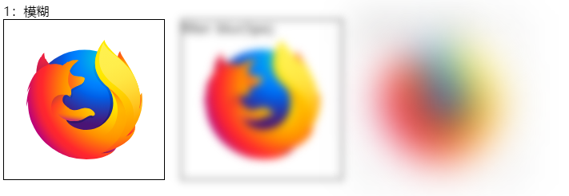
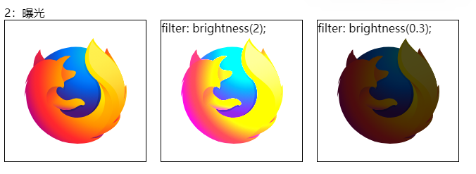
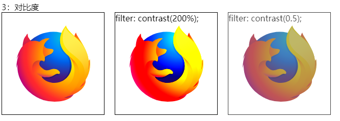
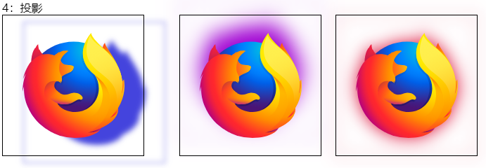
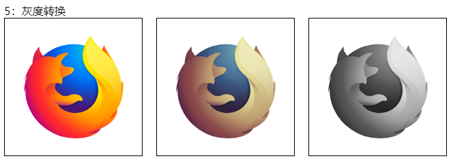
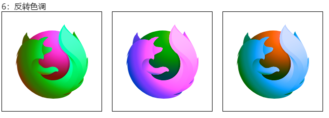
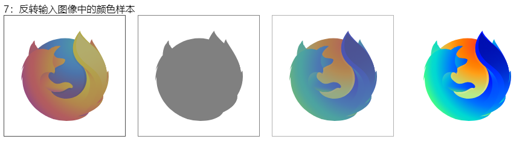
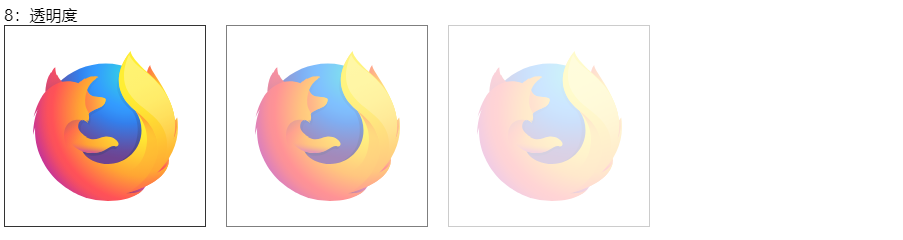
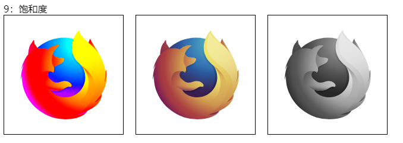
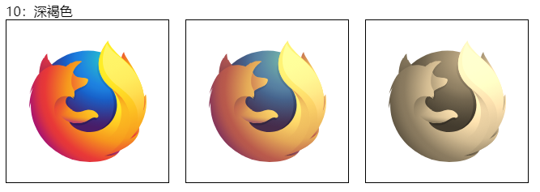

# 阴影

<https://developer.mozilla.org/zh-CN/docs/Web/CSS/filter>

属性将模糊或颜色偏移等图形效果应用于元素。滤镜通常用于调整图像、背景和边框的渲染。

```css
/* <filter-function> 值 */
filter: blur(5px);
filter: brightness(0.4);
filter: contrast(200%);
filter: drop-shadow(16px 16px 20px blue);
filter: grayscale(50%);
filter: hue-rotate(90deg);
filter: invert(75%);
filter: opacity(25%);
filter: saturate(30%);
filter: sepia(60%);

/* URL */
filter: url("filters.svg#filter-id");

/* 多个滤镜 */
filter: contrast(175%) brightness(3%);
filter: drop-shadow(3px 3px red) sepia(100%) drop-shadow(-3px -3px blue);

/* 不使用滤镜 */
filter: none;

/* 全局值 */
filter: inherit;
filter: initial;
filter: revert;
filter: revert-layer;
filter: unset;
```

## 函数

`filter` 属性可设置为 `none` 或下面列出的一个或多个函数。如果任何函数的参数无效，则该函数返回 `none`。除特殊说明外，函数的值如果接受百分比值（如 `34%`），那么该函数也接受小数值（如 `0.34`）。

当单个 `filter` 属性具有多个函数时，滤镜将按顺序依次应用。


### 模糊：blur()

将高斯模糊应用于输入图像。

模糊的半径，值为`<length>`。它定义了高斯函数的标准偏差值，即屏幕上有多少像素相互融合; 因此，较大的值会产生更多模糊。值为 0 会使输入保持不变。该值为空则为 0。

```CSS
filter: blur(5px);

blur(0)        /* No effect */
blur(8px)      /* Blur with 8px radius */
blur(1.17rem)  /* Blur with 1.17rem radius */
```



### 曝光： brightness()

将线性乘法器应用于输入图像，以调整其亮度。值为 0% 将创建全黑图像；值为 100% 会使输入保持不变，其他值是该效果的线性乘数。如果值大于 100% 将使图像更加明亮。

```CSS
filter: brightness(2);

brightness(0%)   /* 全黑 */
brightness(0.4)  /* 40% 亮度 */
brightness(1)    /* 无效果 */
brightness(200%) /* 两倍亮度 */
```



### 对比度：contrast()

调整输入图像的对比度。值是 0% 将使图像变灰；值是 100%，则无影响；若值超过 100% 将增强对比度。该值为空时默认为 1。

```CSS
filter: contrast(200%);

contrast(0)     /* 完全灰色 */
contrast(65%)   /* 65% 对比度 */
contrast(1)     /* 无效果 */
contrast(200%)  /* 两倍对比度 */
```



### 投影：drop-shadow()

使用 `<shadow>` 参数沿图像的轮廓生成阴影效果。阴影语法类似于 `<box-shadow>`（在 CSS 背景和边框模块中定义），但不允许使用 inset 关键字以及 spread 参数。与所有 filter 属性值一样，任何在 drop-shadow() 后的滤镜同样会应用在阴影上。

```CSS

drop-shadow(X轴偏移量 Y轴偏移量 模糊半径 延伸半径 颜色)

filter: drop-shadow(16px 16px 10px black);

/*10倍模糊的黑色阴影 */
drop-shadow(16px 16px 10px black)

/* 红色阴影，1个em模糊和.3个em扩散 */
/* 警告：大多数浏览器不支持这个参数;如果使用，效果将不会呈现。*/
drop-shadow(.5rem .5rem 1rem .3rem #e23)
```



### 灰度转换：grayscale()

将图像转换为灰度图。值为 100% 则完全转为灰度图像，若为初始值 0% 则图像无变化。值在 0% 到 100% 之间，则是该效果的线性乘数。

```CSS
filter: grayscale(100%);

grayscale(0)     /* 无效果 */
grayscale(.7)    /* 70% 灰度 */
grayscale(100%)  /* 灰度最大 */
```



### 反转色调：hue-rotate()

应用色相旋转。`<angle>` 值设定图像会被调整的色环角度值。值为 0deg，则图像无变化。

```CSS
filter: hue-rotate(90deg);
filter: hue-rotate(-0.25turn);
filter: hue-rotate(3.142rad);
```



### 反转输入图像中的颜色样本：invert()

反转输入图像。值为 100% 则图像完全反转，值为 0% 则图像无变化。值在 0% 和 100% 之间，则是该效果的线性乘数。

```CSS
filter: invert(100%);

invert(0)     /* No effect */
invert(.6)    /* 60% inversion */
invert(100%)  /* Completely inverted */
```



### 透明度：opacity()

应用透明度。值为 0% 则使图像完全透明，值为 100% 则图像无变化。

```CSS
filter: opacity(50%);

opacity(1)    /* 无效果 */
opacity(50%)  /* 50% 透明 */
opacity(0%)   /* 完全透明*/
```



### 饱和度：saturate()

改变图像饱和度。值为 0% 则是完全不饱和，值为 100% 则图像无变化。超过 100% 则增加饱和度。

```CSS
filter: saturate(200%);

saturate(0)     /* 完全不饱和 */
saturate(.4)    /* 40% 饱和 */
saturate(100%)  /* 没有效果 */
saturate(200%)  /* 双重饱和*/
```



### 深褐色：sepia()

将图像转换为深褐色。值为 100% 则完全是深褐色的，值为 0% 图像无变化。

将输入图像转换为深褐色(`sepia`)，使其看起来更温暖、更黄/棕色。

```CSS
filter: sepia(100%);
```



## 组合函数

你可以组合任意数量的函数来控制渲染。滤镜将按声明顺序依次应用。以下示例增强了图像的对比度和亮度。

```css
filter: contrast(175%) brightness(103%);
```

---

重复滤镜函数

```css
#MDN-logo {
  border: 1px solid blue;
  filter: drop-shadow(5px 5px 0 red) hue-rotate(180deg) drop-shadow(5px 5px 0
        red);
}
```
