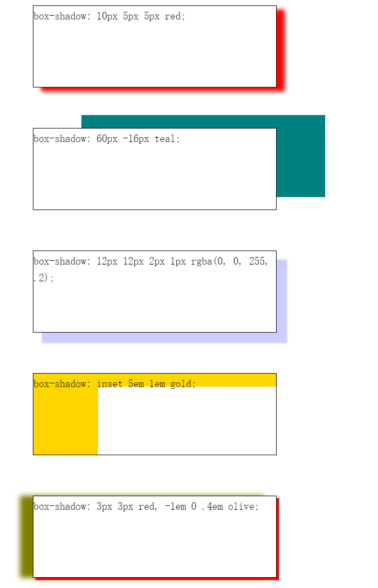
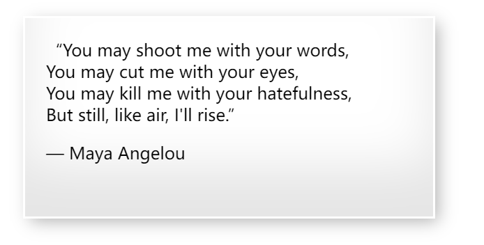

# 阴影

<https://developer.mozilla.org/zh-CN/docs/Web/CSS/filter>

属性将模糊或颜色偏移等图形效果应用于元素。滤镜通常用于调整图像、背景和边框的渲染。

```css
/* <filter-function> 值 */
filter: blur(5px);
filter: brightness(0.4);
filter: contrast(200%);
filter: drop-shadow(16px 16px 20px blue);
filter: grayscale(50%);
filter: hue-rotate(90deg);
filter: invert(75%);
filter: opacity(25%);
filter: saturate(30%);
filter: sepia(60%);

/* URL */
filter: url("filters.svg#filter-id");

/* 多个滤镜 */
filter: contrast(175%) brightness(3%);
filter: drop-shadow(3px 3px red) sepia(100%) drop-shadow(-3px -3px blue);

/* 不使用滤镜 */
filter: none;

/* 全局值 */
filter: inherit;
filter: initial;
filter: revert;
filter: revert-layer;
filter: unset;
```

## 函数

`filter` 属性可设置为 `none` 或下面列出的一个或多个函数。如果任何函数的参数无效，则该函数返回 `none`。除特殊说明外，函数的值如果接受百分比值（如 `34%`），那么该函数也接受小数值（如 `0.34`）。

当单个 `filter` 属性具有多个函数时，滤镜将按顺序依次应用。


### 模糊：blur()

将高斯模糊应用于输入图像。

模糊的半径，值为`<length>`。它定义了高斯函数的标准偏差值，即屏幕上有多少像素相互融合; 因此，较大的值会产生更多模糊。值为 0 会使输入保持不变。该值为空则为 0。

```CSS
filter: blur(5px);

blur(0)        /* No effect */
blur(8px)      /* Blur with 8px radius */
blur(1.17rem)  /* Blur with 1.17rem radius */
```


### 曝光： brightness()

将线性乘法器应用于输入图像，以调整其亮度。值为 0% 将创建全黑图像；值为 100% 会使输入保持不变，其他值是该效果的线性乘数。如果值大于 100% 将使图像更加明亮。

```CSS
filter: brightness(2);

brightness(0%)   /* 全黑 */
brightness(0.4)  /* 40% 亮度 */
brightness(1)    /* 无效果 */
brightness(200%) /* 两倍亮度 */
```


### 对比度：contrast()

调整输入图像的对比度。值是 0% 将使图像变灰；值是 100%，则无影响；若值超过 100% 将增强对比度。该值为空时默认为 1。

```CSS
filter: contrast(200%);

contrast(0)     /* 完全灰色 */
contrast(65%)   /* 65% 对比度 */
contrast(1)     /* 无效果 */
contrast(200%)  /* 两倍对比度 */
```


### 投影：drop-shadow()

使用 `<shadow>` 参数沿图像的轮廓生成阴影效果。阴影语法类似于 `<box-shadow>`（在 CSS 背景和边框模块中定义），但不允许使用 inset 关键字以及 spread 参数。与所有 filter 属性值一样，任何在 drop-shadow() 后的滤镜同样会应用在阴影上。

```CSS

drop-shadow(X轴偏移量 Y轴偏移量 模糊半径 延伸半径 颜色)

filter: drop-shadow(16px 16px 10px black);

/*10倍模糊的黑色阴影 */
drop-shadow(16px 16px 10px black)

/* 红色阴影，1个em模糊和.3个em扩散 */
/* 警告：大多数浏览器不支持这个参数;如果使用，效果将不会呈现。*/
drop-shadow(.5rem .5rem 1rem .3rem #e23)
```


### 灰度转换：grayscale()

将图像转换为灰度图。值为 100% 则完全转为灰度图像，若为初始值 0% 则图像无变化。值在 0% 到 100% 之间，则是该效果的线性乘数。

```CSS
filter: grayscale(100%);

grayscale(0)     /* 无效果 */
grayscale(.7)    /* 70% 灰度 */
grayscale(100%)  /* 灰度最大 */
```


### 反转色调：hue-rotate()

应用色相旋转。`<angle>` 值设定图像会被调整的色环角度值。值为 0deg，则图像无变化。

```CSS
filter: hue-rotate(90deg);
filter: hue-rotate(-0.25turn);
filter: hue-rotate(3.142rad);
```


### 反转输入图像中的颜色样本：invert()

反转输入图像。值为 100% 则图像完全反转，值为 0% 则图像无变化。值在 0% 和 100% 之间，则是该效果的线性乘数。

```CSS
filter: invert(100%);

invert(0)     /* No effect */
invert(.6)    /* 60% inversion */
invert(100%)  /* Completely inverted */
```


### 透明度：opacity()

应用透明度。值为 0% 则使图像完全透明，值为 100% 则图像无变化。

```CSS
filter: opacity(50%);

opacity(1)    /* 无效果 */
opacity(50%)  /* 50% 透明 */
opacity(0%)   /* 完全透明*/
```


### 饱和度：saturate()

改变图像饱和度。值为 0% 则是完全不饱和，值为 100% 则图像无变化。超过 100% 则增加饱和度。

```CSS
filter: saturate(200%);

saturate(0)     /* 完全不饱和 */
saturate(.4)    /* 40% 饱和 */
saturate(100%)  /* 没有效果 */
saturate(200%)  /* 双重饱和*/
```


### 深褐色：sepia()

将图像转换为深褐色。值为 100% 则完全是深褐色的，值为 0% 图像无变化。

将输入图像转换为深褐色(`sepia`)，使其看起来更温暖、更黄/棕色。

```CSS
filter: sepia(100%);
```


## 组合函数

你可以组合任意数量的函数来控制渲染。滤镜将按声明顺序依次应用。以下示例增强了图像的对比度和亮度。

```css
filter: contrast(175%) brightness(103%);
```

---

重复滤镜函数

```css
#MDN-logo {
  border: 1px solid blue;
  filter: drop-shadow(5px 5px 0 red) hue-rotate(180deg) drop-shadow(5px 5px 0
        red);
}
```

---

## box-shadow 元素的框架上添加阴影效果

你可以在同一个元素上设置多个阴影效果，并用逗号将他们分隔开。该属性可设置的值包括阴影的 X 轴偏移量、Y 轴偏移量、模糊半径、扩散半径和颜色。

你几乎可以在任何元素上使用`box-shadow`来添加阴影效果。如果元素同时设置了 `border-radius`属性，那么阴影也会有圆角效果。
多个阴影在 `z` 轴上的顺序和多个 `text-shadows` 规则相同 (第一个阴影在最上面)。

```css
/* x 偏移量 | y 偏移量 | 阴影颜色 */
box-shadow: 60px -16px teal;

/* x 偏移量 | y 偏移量 | 阴影模糊半径 | 阴影颜色 */
box-shadow: 10px 5px 5px black;

/* x 偏移量 | y 偏移量 | 阴影模糊半径 | 阴影扩散半径 | 阴影颜色 */
box-shadow: 2px 2px 2px 1px rgba(0, 0, 0, 0.2);

/* 插页 (阴影向内) | x 偏移量 | y 偏移量 | 阴影颜色 */
box-shadow: inset 5em 1em gold;

/* 任意数量的阴影，以逗号分隔 */
box-shadow:
  3px 3px red,
  -1em 0 0.4em olive;

/* 全局关键字 */
box-shadow: inherit;
box-shadow: initial;
box-shadow: unset;
```

向元素添加单个 box-shadow 效果时使用以下规则：

- 当给出两个、三个或四个 `<length>`值时。
  - 如果只给出两个值，那么这两个值将会被当作 `<offset-x><offset-y>` 来解释。
  - 如果给出了第三个值，那么第三个值将会被当作`<blur-radius>`解释。
  - 如果给出了第四个值，那么第四个值将会被当作`<spread-radius>`来解释。
- 可选，`inset`关键字。
- 可选，`<color>`值。
若要对同一个元素添加多个阴影效果，请使用逗号将每个阴影规则分隔开。

```css
box-shadow: 10px 5px 5px red;
box-shadow: 60px -16px teal;
box-shadow: 12px 12px 2px 1px rgba(0, 0, 255, .2);
box-shadow: inset 5em 1em gold;
box-shadow: 3px 3px red, -1em 0 .4em olive;
```

[box-shadow.html](Code/阴影/box-shadow.html)



### 取值

#### inset

如果没有指定inset，默认阴影在边框外，即阴影向外扩散。 使用 inset 关键字会使得阴影落在盒子内部，这样看起来就像是内容被压低了。此时阴影会在边框之内 (即使是透明边框）、背景之上、内容之下。

#### `<offset-x> <offset-y>`

这是头两个 `<length>` 值，用来设置阴影偏移量。x,y 是按照数学二维坐标系来计算的，只不过 y 垂直方向向下。 `<offset-x>` 设置水平偏移量，正值阴影则位于元素右边，负值阴影则位于元素左边。 `<offset-y>` 设置垂直偏移量，正值阴影则位于元素下方，负值阴影则位于元素上方。可用单位请查看 `<length>` 。 如果两者都是 0，那么阴影位于元素后面。这时如果设置了`<blur-radius>` 或`<spread-radius>` 则有模糊效果。需要考虑 `inset`.

#### 模糊半径`<blur-radius>`

这是第三个 `<length>` 值。**值越大，模糊面积越大，阴影就越大越淡**。不能为负值。默认为 `0`，此时阴影边缘锐利。本规范不包括如何计算模糊半径的精确算法，但是，它详细说明如下：

> 对于长而直的阴影边缘，它会创建一个过渡颜色用于模糊 以阴影边缘为中心、模糊半径为半径的局域，过渡颜色的范围在完整的阴影颜色到它最外面的终点的透明之间。 （译者注：对此有兴趣的可以了解下数字图像处理的模糊算法。）

#### 展开半径`<spread-radius>`

这是第四个 `<length>` 值。**取正值时，阴影扩大；取负值时，阴影收缩**。默认为 0，此时阴影与元素同样大。需要考虑 `inset`

#### 颜色`<color>`

相关事项查看 `<color>` 。如果没有指定，则由浏览器决定——通常是color的值，不过目前 Safari 取透明。

### 合成

- 将 none 看做是长度为 0 的列表。

列表中的每个阴影通过color组件（作为颜色），以及 x，y，blur，（合适的时候）加上 spread 组件（作为长度）进行合成。
对于每个阴影，

- 如果两个输入的阴影都是 inset 或者都不是 inset，那么要添加的阴影必须考虑已存在的阴影。
- 如果任何一对输入阴影中，一个是 inset，另一个不是 inset，那么整个阴影列表就是不可合成的。
- 如果阴影列表有不同的长度，那么较短的列表会在尾部补上这类阴影：颜色透明，所有长度为 0，inset 还是非 inset 同较长的列表。

### 设置多种阴影

包括了三种 shadow，

1. 内置的阴影
2. 常规的下沉阴影，
3. 和一个 2 个像素宽度的 border 式的阴影 (可以用 outline 来替代第三种)。

```css
blockquote {
  padding: 20px;
  box-shadow:
    inset 0 -3em 3em rgba(0, 0, 0, 0.1),
    0 0 0 2px rgb(255, 255, 255),
    0.3em 0.3em 1em rgba(0, 0, 0, 0.3);
}
```


