# CSS选择器

> <https://developer.mozilla.org/zh-CN/docs/Web/CSS/Reference#%E9%80%89%E6%8B%A9%E5%99%A8>
> 本文档最后更新日期： 2024年1月19日17:04:29

## 备忘录

选择器名称 | 语法 |  示例| 简介 | 备注
--|--|--|--|-
[通用选择器](#通配选择器)|`*` `ns\|*` `*\|*` | `*.warning {}`|`*` 它可以匹配任意类型的 HTML 元素 |效率低，不推荐
[元素选择器](#类型选择器元素选择器)|`a {  }`|`a {  }`|所有 `<a>` 元素|
[类选择器](#类选择器)|`.a {  }`|`li.spacious {  }`|所有含有 class="spacious" 类的 `<li>` 元素
[ID 选择器](#id-选择器)|`#a {  }`|`#demo { }`|id 为 "demo" 的元素会被选中
[属性选择器](#属性选择器)|`[attr]`|`a {  color: blue;}`|表示带有以 a 命名的属性的元素。
 ^|`[attr=value]`|`div[lang="pt"] {}`|表示带有以 attr 命名的属性，且属性值为 value 的元素。
 ^|`[attr~=value]`|`div[lang~="en-us"] {}`|表示带有以 lang 命名的属性的元素，并且该属性是一个以空格作为分隔的值列表，其中至少有一个值为 value。
 ^|`[attr\|=value]`|`div[lang\|="zh"] {}`|表示带有以 lang 命名的属性的元素，属性值为“value”或是以“value-”为前缀（- 为连字符，Unicode 编码为 U+002D）开头。典型的应用场景是用来匹配语言简写代码（如 zh-CN、zh-TW 可以用 zh 作为 value）。
 ^|`[attr^=value]`|`a[href^="#"] {}`|表示带有以 href 命名的属性，且属性值是以 value 开头的元素。
 ^|`[attr$=value]`|`a[href$=".org"] {}`|表示带有以 href 命名的属性，且属性值是以 value 结尾的元素。
^|`[attr*=value]`|`a[href*="example"] {}`|表示带有以 href 命名的属性，且属性值至少包含一个 value 值的元素。
^|`[attr operator value i]`|`a[href*="insensitive" i] {}`|在属性选择器的右方括号前添加一个用空格隔开的字母 i（或 I），可以在匹配属性值时忽略大小写（支持 ASCII 字符范围之内的字母）。
^|`[attr operator value s]` *实验性*|`a[href*="cAsE" s] {}`|在属性选择器的右方括号前添加一个用空格隔开的字母 s（或 S），可以在匹配属性值时区分大小写（支持 ASCII 字符范围之内的字母）。
[选择器列表](#选择器列表)|`A, B`|`div, span{}` 会同时匹配 `<span>` 元素和 `<div>` 元素。
^|当一个选择器列表包含一个无效的选择器时，整个样式块将被无效化。
^|可容错选择器|`:is(span, div) {}`|优先级是它最具体的参数。
^|^|`:where(span, div) {}`|不添加任何优先级权重。
[后代选择器](#后代组合器)|`A B` 空格|>|`div span` 匹配所有位于任意 `<div>`元素之内的 `<span>` 元素。|不止一层。
[直接子代组合器](#子组合器)|`A > B`|>|`ul > li` 匹配直接嵌套在 `<ul>`元素内的所有 `<li>` 元素。|只有一层。
[一般兄弟组合器](#后续兄弟选择器)|`A ~ B`|>|`p ~ span` 匹配同一父元素下，`<p>` 元素后的所有 `<span>` 元素。|同级，此元素后面的B
[紧邻兄弟组合器](#接续兄弟组合器)|`A + B`|>|`h2 + p` 会匹配紧邻在 `h2` 元素后的第一个 `<p>` 元素。|
[列组合器](#列组合器所有游览器未实现)|`A \|\| B`|>|`col \|\| td` 会匹配所有 `<col>` 作用域内的 `<td>` 元素|游览器不支持
[伪类](#伪选择器-pseudo)|`:`|例子：`a:visited` 匹配所有曾被访问过的 `<a>` 元素。
[伪元素](#伪元素)|`::`|例子：`p::first-line` 匹配所有 `<p>` 元素的第一行。
[嵌套选择器](#嵌套选择器)|`&`|`a, b {  color: red;& c { color: blue; }}`|a,b是红色，但里面的c是蓝色|游览器版本高于112，2023-4-11以后得版本

## 基本选择器

### 通配选择器

基本选择器是选择器中最初级的，通常由它们的组合构成其他更复杂的选择器。

>备注： ***不推荐使用通配选择器***，因为它是性能最低的一个 CSS 选择器.
>
> 选择所有元素。（可选）可以将其限制为特定的名称空间或所有名称空间。
语法：`*` `ns|*` `*|*`
例子：`*`将匹配文档的所有元素。

#### 通配选择器概述

在 CSS 中，一个星号 (`*`) 就是一个通配选择器。它可以匹配任意类型的 HTML 元素。在配合其他简单选择器的时候，省略掉通配选择器会有同样的效果。比如，`*.warning` 和`.warning` 的效果完全相同。

在 CSS3 中，星号 (`*`) 可以和命名空间组合使用：

`ns|*` - 会匹配ns命名空间下的所有元素
`*|*` - 会匹配所有命名空间下的所有元素
`|*` - 会匹配所有没有命名空间的元素

#### 通配选择器示例

```CSS
*[lang^="en"] {
  color: green;
}
*.warning {
  color: red;
}
*#maincontent {
  border: 1px solid blue;
}
```

上面的 CSS 作用于下面的 HTML:

```HTML
<p class="warning">
  <span lang="en-us">A green span</span> in a red paragraph.
</p>
<p id="maincontent" lang="en-gb">
  <span class="warning">A red span</span> in a green paragraph.
</p>
```

则会产生这样的效果：

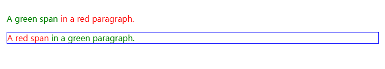

---

### 类型选择器/元素选择器

> 按照给定的节点名称，选择所有匹配的元素。
> 语法：elementname
> 例子：input 匹配任何 `<input>` 元素。  

CSS **类型选择器**通过节点名称匹配元素。换句话说，它选择一个文件中所有给定类型的元素。

```CSS
/* 所有 <a> 元素。*/
a {
  color: red;
}
```

类型选择器可以使用 `@namespace` 赋予命名空间。这在处理包含多个命名空间的文件时很有用，比如带有内联 SVG 或 MathML 的 HTML 文档，或者混合了多个词汇的 XML 文档。

- `ns|h1`——匹配命名空间为 ns 的 `<h1>` 元素
- `*|h1`——匹配所有 `<h1>` 元素
- `|h1`——匹配没有声明命名空间的 `<h1>` 元素
  
#### 元素选择器语法

```CSS
元素 { 样式声明 }
```

#### 元素选择器示例

```CSS
span {
  background-color: skyblue;
}
```

```HTML
<span>这里是由 span 元素包裹的一些文字。</span>
<p>这里是由 p 元素包裹的一些文字。</p>
<span>这里是由 span 元素包裹的一些文字。</span>
```

#### 元素选择器结果

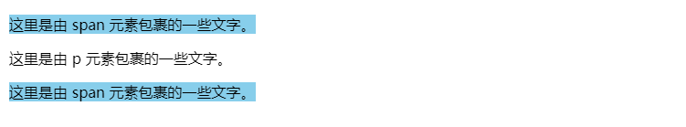

#### 命名空间

在这个示例中，选择器将仅匹配 example 命名空间的 `<h1>` 元素。

```CSS
@namespace example url(http://www.example.com);
example|h1 {
  color: blue;
}
```

---

### 类选择器

> 按照给定的 `class` 属性的值，选择所有匹配的元素。
> 语法：`.classname`
> 例子：`.index` 匹配任何 `class` 属性中含有 "index" 类的元素。

CSS 类选择器根据 class 属性的内容匹配元素。

```CSS
/* 所有含有 class="spacious" 类的元素 */
.spacious {
  margin: 2em;
}

/* 所有含有 class="spacious" 类的 <li> 元素 */
li.spacious {
  margin: 2em;
}

/* 所有同时含有“spacious”和“elegant”类的 <li> 元素 */
/* 例如 class="elegant retro spacious" */
li.spacious.elegant {
  margin: 2em;
}
```

#### 类选择器语法

```CSS
.类名 { 样式声明 }
```

注意它与下面的属性选择器语句等价：

```CSS
[class~=类名] { 样式声明 }
```

#### 类选择器示例

```CSS
.red {
  color: #f33;
}

.yellow-bg {
  background: #ffa;
}

.fancy {
  font-weight: bold;
  text-shadow: 4px 4px 3px #77f;
}
```

```HTML
<p class="red">这段文字是红色的。</p>
<p class="red yellow-bg">这段文字是红色的，背景是黄色的。</p>
<p class="red fancy">这段文字是红色的，有“fancy”样式。</p>
<p>这只是普通的段落。</p>
```

结果

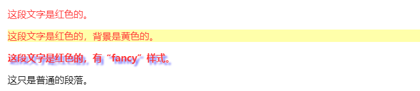

---

### ID 选择器

> 按照 `id` 属性选择一个与之匹配的元素。需要注意的是，一个文档中，每个 ID 属性都应当是唯一的。
语法：`#idname`
例子：`#toc` 匹配 ID 为 "toc" 的元素。

CSS ID 选择器会根据该元素的 id 属性中的内容匹配元素。为了使该元素被选中，它的 id 属性必须与选择器中给出的值完全匹配。

```CSS
/* id 为 "demo" 的元素会被选中 */
#demo {
  border: red 2px solid;
}
```

#### ID 选择器语法

```CSS
#id 属性值 { 样式声明 }
```

它与下面的属性选择器语句语法上等价（但优先级并不等价）：

```CSS
[id=id 属性值] { 样式声明 }
```

#### ID 选择器示例

```CSS
#identified {
  background-color: skyblue;
}
```

```HTML
<div id="identified">这个 div 有一个特别的 ID 属性！</div>
<div>这只是一个普通的 div。</div>
```

#### ID 选择器结果

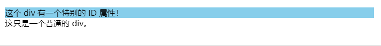

---

### &嵌套选择器

><https://drafts.csswg.org/css-nesting/#nest-selector>

```css
/* & 可以单独使用 */
.foo {
  color: blue;
  & > .bar { color: red; }
  > .baz { color: green; }
}
/* 相当于
  .foo { color: blue; }
  .foo > .bar { color: red; }
  .foo > .baz { color: green; }
*/


/* 或者在复合选择器中，细化父对象的选择器 */
.foo {
  color: blue;
  &.bar { color: red; }
}
/* equivalent to
  .foo { color: blue; }
  .foo.bar { color: red; }
*/

/* 列表中的多个选择器都是相对于父级的  */
.foo, .bar {
  color: blue;
  + .baz, &.qux { color: red; }
}
/* equivalent to
  .foo, .bar { color: blue; }
  :is(.foo, .bar) + .baz,
  :is(.foo, .bar).qux { color: red; }
*/

/* & 可以在单个选择器中多次使用 */
.foo {
  color: blue;
  & .bar & .baz & .qux { color: red; }
}
/* equivalent to
  .foo { color: blue; }
  .foo .bar .foo .baz .foo .qux { color: red; }
*/

/* & 不必在选择器的开头 */

.foo {
  color: red;
  .parent & {
    color: blue;
  }
}
/* equivalent to
  .foo { color: red; }
  .parent .foo { color: blue; }
*/

.foo {
  color: red;
  :not(&) {
    color: blue;
  }
}
/* equivalent to
  .foo { color: red; }
  :not(.foo) { color: blue; }
*/

/* 但如果使用相对选择器，则会自动隐含一个初始& */
.foo {
  color: red;
  + .bar + & { color: blue; }
}

/* equivalent to
  .foo { color: red; }
  .foo + .bar + .foo { color: blue; }
*/

/* 有点傻，但是&也可以单独使用。 */
.foo {
  color: blue;
  & { padding: 2ch; }
}
/* equivalent to
  .foo { color: blue; }
  .foo { padding: 2ch; }

  // or

  .foo {
    color: blue;
    padding: 2ch;
  }
*/

/* 再说一遍，很傻，但甚至可以加倍。 */
.foo {
  color: blue;
  && { padding: 2ch; }
}
/* equivalent to
  .foo { color: blue; }
  .foo.foo { padding: 2ch; }
*/

/* 父选择器可以任意复杂 */
.error, #404 {
  &:hover > .baz { color: red; }
}
/* equivalent to
  :is(.error, #404):hover > .baz { color: red; }
*/

.ancestor .el {
  .other-ancestor & { color: red; }
}
/* equivalent to
  .other-ancestor :is(.ancestor .el) { color: red; }

/* 嵌套选择器也可以 */
.foo {
  & :is(.bar, &.baz) { color: red; }
}
/* equivalent to
  .foo :is(.bar, .foo.baz) { color: red; }
*/

/* 多级嵌套“堆叠”选择器 */
figure {
  margin: 0;

  > figcaption {
    background: hsl(0 0% 0% / 50%);

    > p {
      font-size: .9rem;
    }
  }
}
/* equivalent to
  figure { margin: 0; }
  figure > figcaption { background: hsl(0 0% 0% / 50%); }
  figure > figcaption > p { font-size: .9rem; }
*/

/* 级联层的使用示例 */
@layer base {
  html {
    block-size: 100%;

    body {
      min-block-size: 100%;
    }
  }
}
/* equivalent to
  @layer base {
    html { block-size: 100%; }
    html body { min-block-size: 100%; }
  }
*/

/* 嵌套层叠层示例 */
@layer base {
  html {
    block-size: 100%;

    @layer support {
      body {
        min-block-size: 100%;
      }
    }
  }
}
/* equivalent to
  @layer base {
    html { block-size: 100%; }
  }
  @layer base.support {
    html body { min-block-size: 100%; }
  }
*/

/* 范围界定的示例用法 */
@scope (.card) to (> header) {
  :scope {
    inline-size: 40ch;
    aspect-ratio: 3/4;

    > header {
      border-block-end: 1px solid white;
    }
  }
}
/* equivalent to
  @scope (.card) to (> header) {
    :scope { inline-size: 40ch; aspect-ratio: 3/4; }
    :scope > header { border-block-end: 1px solid white; }
  }
*/

/* 嵌套范围界定示例 */
.card {
  inline-size: 40ch;
  aspect-ratio: 3/4;

  @scope (&) to (> header > *) {
    :scope > header {
      border-block-end: 1px solid white;
    }
  }
}

/* equivalent to
  .card { inline-size: 40ch; aspect-ratio: 3/4; }
  @scope (.card) to (> header > *) {
    :scope > header { border-block-end: 1px solid white; }
  }
*/
```

---

### 属性选择器

> 按照给定的属性，选择所有匹配的元素。
>
> 语法：`[attr]` `[attr=value]` `[attr~=value]` `[attr|=value]` `[attr^=value]` `[attr$=value]` `[attr*=value]`
>
> 例子：`[autoplay]` 选择所有具有 `autoplay` 属性的元素（不论这个属性的值是什么）。

CSS 属性选择器匹配那些具有特定属性或属性值的元素。

```CSS
/* 存在 title 属性的 <a> 元素 */
a[title] {
  color: purple;
}

/* 存在 href 属性并且属性值匹配"https://example.org"的 <a> 元素 */
a[href="https://example.org"]
{
  color: green;
}

/* 存在 href 属性并且属性值包含"example"的 <a> 元素 */
a[href*="example"] {
  font-size: 2em;
}

/* 存在 href 属性并且属性值结尾是".org"的 <a> 元素 */
a[href$=".org"] {
  font-style: italic;
}

/* 存在 class 属性并且属性值包含单词"logo"的<a>元素 */
a[class~="logo"] {
  padding: 2px;
}
```

#### 属性选择器语法

`[attr]`
表示带有以 attr 命名的属性的元素。

`[attr=value]`
表示带有以 attr 命名的属性，且属性值为 value 的元素。

`[attr~=value]`
表示带有以 attr 命名的属性的元素，并且该属性是一个以空格作为分隔的值列表，其中至少有一个值为 value。

`[attr|=value]`
表示带有以 attr 命名的属性的元素，属性值为“value”或是以“value-”为前缀（- 为连字符，Unicode 编码为 U+002D）开头。典型的应用场景是用来匹配语言简写代码（如 zh-CN、zh-TW 可以用 zh 作为 value）。

`[attr^=value]`
表示带有以 attr 命名的属性，且属性值是以 value 开头的元素。

`[attr$=value]`
表示带有以 attr 命名的属性，且属性值是以 value 结尾的元素。

`[attr*=value]`
表示带有以 attr 命名的属性，且属性值至少包含一个 value 值的元素。

`[attr operator value i]`
在属性选择器的右方括号前添加一个用空格隔开的字母 i（或 I），可以在匹配属性值时忽略大小写（支持 ASCII 字符范围之内的字母）。

`[attr operator value s]` 实验性
在属性选择器的右方括号前添加一个用空格隔开的字母 s（或 S），可以在匹配属性值时区分大小写（支持 ASCII 字符范围之内的字母）。

#### 属性选择器示例

##### 属性选择器-链接

CSS

```CSS
a {
  color: blue;
}

/* 以 "#" 开头的页面内部链接 */
a[href^="#"] {
  background-color: gold;
}

/* 包含 "example" 的链接 */
a[href*="example"] {
  background-color: silver;
}

/* 包含 "insensitive" 的链接，不区分大小写 */
a[href*="insensitive" i] {
  color: cyan;
}

/* 包含 "cAsE" 的链接，区分大小写 */
a[href*="cAsE" s] {
  color: pink;
}

/* 以 ".org" 结尾的链接 */
a[href$=".org"] {
  color: red;
}

/* 以 "https" 开始，".org" 结尾的链接 */
a[href^="https"][href$=".org"] {
  color: green;
}
```

HTML

```HTML
<ul>
  <li><a href="#internal">内部链接</a></li>
  <li><a href="http://example.com">示例链接</a></li>
  <li><a href="#InSensitive">非敏感内部链接</a></li>
  <li><a href="http://example.org">示例 org 链接</a></li>
  <li><a href="https://example.org">示例 https org 链接</a></li>
</ul>
```

结果

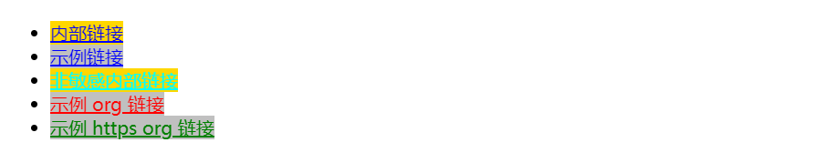

##### 属性选择器-多语言

```CSS
/* 将所有包含 `lang` 属性的 <div> 元素的字重设为 bold */
div[lang] {
  font-weight: bold;
}

/* 将所有语言为美式英语的 <div> 元素的文本颜色设为蓝色 */
div[lang~="en-us"] {
  color: blue;
}

/* 将所有语言为葡萄牙语的 <div> 元素的文本颜色设为绿色 */
div[lang="pt"] {
  color: green;
}

/* 将所有语言为中文的 <div> 元素的文本颜色设为红色
   无论是简体中文（zh-CN）还是繁体中文（zh-TW） */
div[lang|="zh"] {
  color: red;
}

/* 将所有 `data-lang` 属性的值为 "zh-TW" 的 <div> 元素的文本颜色设为紫色 */
/* 备注：和 JS 不同，CSS 可以在不使用双引号的情况下直接使用带连字符的属性名 */
div[data-lang="zh-TW"] {
  color: purple;
}
```

HTML

```HTML
<div lang="en-us en-gb en-au en-nz">Hello World!</div>
<div lang="pt">Olá Mundo!</div>
<div lang="zh-CN">世界你好！</div>
<div lang="zh-TW">世界你好！</div>
<div data-lang="zh-TW">世界你好！</div>
```

结果


##### 属性选择器-HTML有序列表

HTML 规范要求 type 属性被不分大小写地匹配，因为它主要用于 `<input>`元素中。请注意，如果用户代理不支持这些修饰符，那么选择器将无法匹配。

```CSS
/* 根据文档语言不同，大小写敏感性不同 */
ol[type="a"] {
  list-style-type: lower-alpha;
  background: red;
}
ol[type="b" s] {
  list-style-type: lower-alpha;
  background: lime;
}
ol[type="B" s] {
  list-style-type: upper-alpha;
  background: grey;
}
ol[type="c" i] {
  list-style-type: upper-alpha;
  background: green;
}
```

```HTML
<ol type="A">
  <li>非大小写敏感匹配呈现红色背景（类型选择器默认值）</li>
</ol>
<ol type="b">
  <li>如果支持 `s` 修饰符（大小写敏感匹配），拥有亮绿色背景</li>
</ol>
<ol type="B">
  <li>如果支持 `s` 修饰符（大小写敏感匹配），拥有灰色背景</li>
</ol>
<ol type="C">
  <li>如果支持 `i` 修饰符（大小写不敏感匹配），拥有绿色背景</li>
</ol>
```

结果

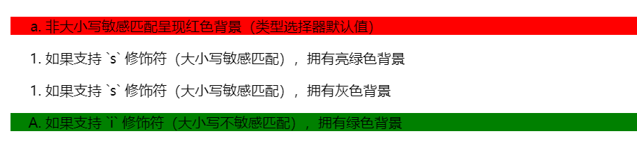

---
---

## 选择器列表

> , 是将不同的选择器组合在一起的方法，它选择所有能被列表中的任意一个选择器选中的节点。
语法：`A, B`
示例：`div, span` 会同时匹配 `<span>` 元素和 `<div>` 元素。

CSS 选择器列表（,）选择所有匹配的节点。选择器列表是以逗号分隔的多个选择器所组成的列表。

### 选择器列表描述

当多个选择器共享相同的声明时，它们可以被编组进一个以逗号分隔的列表。选择器列表也可以作为参数传递给一些函数式 CSS 伪类。逗号之前和/或之后可以有空白（字符）。

以下三个声明是等效的：

```CSS
span {
  border: red 2px solid;
}
div {
  border: red 2px solid;
}
```

```CSS
span,
div {
  border: red 2px solid;
}
```

```CSS
:is(span, div) {
  border: red 2px solid;
}
```

### 选择器列表示例

当对匹配不同条件的元素应用相同的样式时，将选择器编组进一个以逗号分隔的列表中可以在提高样式表的一致性的同时减小尺寸。

#### 单行编组

此示例显示了将选择器编组进一个以逗号分隔的单行列表。

```CSS
h1,
h2,
h3,
h4,
h5,
h6 {
  font-family: helvetica;
}
```

#### 多行编组

此示例显示了将选择器编组进以逗号分隔的多行列表。

```CSS
#main,
.content,
article,
h1 + p {
  font-size: 1.1em;
}
```

### 有效和无效的选择器列表

一个无效的选择器匹配不到任何东西，因此不表示任何东西。当一个选择器列表包含一个无效的选择器时，整个样式块将被忽略，除了接受可容错选择器列表的函数式伪类。

#### 无效的选择器列表

使用选择器列表的一个缺点是选择器列表中的单个不受支持的选择器会使整个规则无效化。

思考以下两个 CSS 规则集：

```CSS
h1 {
  font-family: sans-serif;
}
h2:invalid-pseudo {
  font-family: sans-serif;
}
h3 {
  font-family: sans-serif;
}
```

```CSS
h1,
h2:invalid-pseudo,
h3 {
  font-family: sans-serif;
}
```

它们不是等效的。在第一个规则集中，样式将应用于 h1 和 h3 元素，但 h2:invalid-pseudo 规则将不会被解析。**在第二个规则集中，由于列表中的一个选择器是无效的，整个规则都将不会被解析**。因此，没有样式会被应用到 h1 和 h3 元素：当一个选择器列表中任意选择器无效时，整个样式块将被忽略。

### 可容错选择器列表

解决无效的选择器列表问题的一种方法是使用 `:is()` 或 `:where()` 伪类，它们接受一个可容错选择器列表。可容错选择器列表中的每个选择器都被单独解析。因此列表中任何无效的选择器会被忽略，而有效的选择器则会被有效使用。

继续上一个示例，以下两个 CSS 规则集现在是等效的：

```CSS
h1 {
  font-family: sans-serif;
}
h2:maybe-unsupported {
  font-family: sans-serif;
}
h3 {
  font-family: sans-serif;
}
```

```CSS
:is(h1, h2:maybe-unsupported, h3) {
  font-family: sans-serif;
}
```

这两个的区别在于 `:is()` 的优先级是它最具体的参数，而 `:where()` 选择器和可容错选择器列表参数则不添加任何优先级权重。

### 可容错相对选择器列表

可容错相对选择器列表类似于可容错选择器列表；它只是将列表的组成部分按相对选择器来解析，以显式或隐式的组合器开头。

```CSS
h2:has(+ p, > ul::after, + ul.red) {
  font-style: italic;
}
```

上面，紧跟在 `<p>` 或 `<ul class="red">` 之后的 h2 将会是斜体。虽然 `:has()` 可容错相对选择器列表参数中的伪元素是无效的，但因为列表是可容错的，它不会“中断”选择器。

---

### 组合选择器

#### 后代组合器

> “ ”（空格）组合器选择前一个元素的后代节点。
语法：`A B`
例子：`div span` 匹配所有位于任意 `<div>` 元素之内的 `<span>` 元素。

后代组合器（通常用单个空格（" "）字符表示）组合了两个选择器，如果第二个选择器匹配的元素具有与第一个选择器匹配的祖先（父母，父母的父母，父母的父母的父母等）元素，则它们将被选择。利用后代组合器的选择器称为后代选择器。

```CSS
/* 列出"my-things"列表的子项 */
ul.my-things li {
  margin: 2em;
}
```

从技术上讲，后代组合器是两个选择器之间的一个或多个 CSS 空格字符-空格字符和/或四个控制字符之一：回车，换页，换行和制表符在没有其他组合器的情况下。此外，组成组合器的空白字符可以包含任意数量的 CSS 注释。

##### 后代组合器语法

```text
selector1 selector2 {
  /* property declarations */
}
```

##### 后代组合器示例

```CSS
li {
  list-style-type: disc;
}

/* li 下面的li 是空心圆*/
li li {
  list-style-type: circle;
}
```

```HTML
<ul>
  <li>
    <div>Item 1</div>
    <ul>
      <li>Subitem A</li>
      <li>Subitem B</li>
    </ul>
  </li>
  <li>
    <div>Item 2</div>
    <ul>
      <li>Subitem A</li>
      <li>Subitem B</li>
    </ul>
  </li>
</ul>
```

##### 后代组合器结果

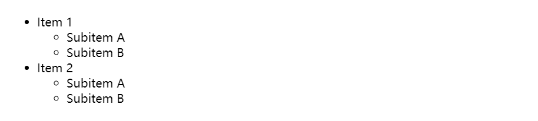

---

### 子组合器

> 组合器选择前一个元素的直接子代的节点。
语法：`A > B`
例子：`ul > li` 匹配直接嵌套在 `<ul>` 元素内的所有 `<li>` 元素。

子组合器（`>`）被放在两个 CSS 选择器之间。它**只匹配那些被第二个选择器匹配的元素**，这些元素是被第一个选择器匹配的元素的直接子元素。

```CSS
/* 选择属于“my-things”类的无序列表（ul）的直接子列表元素（li） */
ul.my-things > li {
  margin: 2em;
}
```

被第二个选择器匹配的元素必须是被第一个选择器匹配的元素的直接子元素。这比后代组合器更严格，后者匹配所有被第二个选择器匹配的元素，这些元素存在被第一个选择器匹配的祖先元素，无论在 DOM 上有多少“跳”。

#### 子组合器语法

```CSS
元素 1 > 元素 2 { 样式声明 }
```

#### 子组合器示例

```CSS
span {
  background-color: aqua;
}

div > span {
  background-color: yellow;
}
```

```HTML
<div>
  <span>
    1 号 span，在 div 中。
    <span>2 号 span，在 div 中的 span 中。</span>
  </span>
</div>
<span>3 号 span，不在 div 中。</span>
```

运行结果

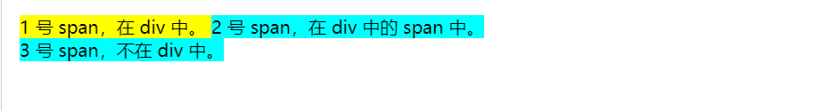

---

### 后续兄弟选择器

> `~` 组合器选择兄弟元素，也就是说，后一个节点在前一个节点后面的任意位置，并且共享同一个父节点。
语法：`A ~ B`
例子：`p ~ span` 匹配同一父元素下，`<p>` 元素后的所有 `<span>` 元素。

后续兄弟选择器（`~`）将两个选择器分开，并匹配第二个选择器的所有迭代元素，位置无须紧邻于第一个元素，只须有相同的父级元素。

```CSS
/* 在任意图像后的兄弟段落 */
img ~ p {
  color: red;
}
```

#### 后续兄弟选择器语法

```CSS
former_element ~ target_element { style properties }
```

#### 后续兄弟选择器示例

```CSS
p ~ span {
  color: red;
}
```

```HTML
<span>This is not red.</span>
<p>Here is a paragraph.</p>
<code>Here is some code.</code>
<span>And here is a red span!</span>
<span>And this is a red span!</span>
<code>More code…</code>
<div>How are you?</div>
<p>Whatever it may be, keep smiling.</p>
<h1>Dream big</h1>
<span>And yet again this is a red span!</span>
```

#### 后续兄弟选择器结果

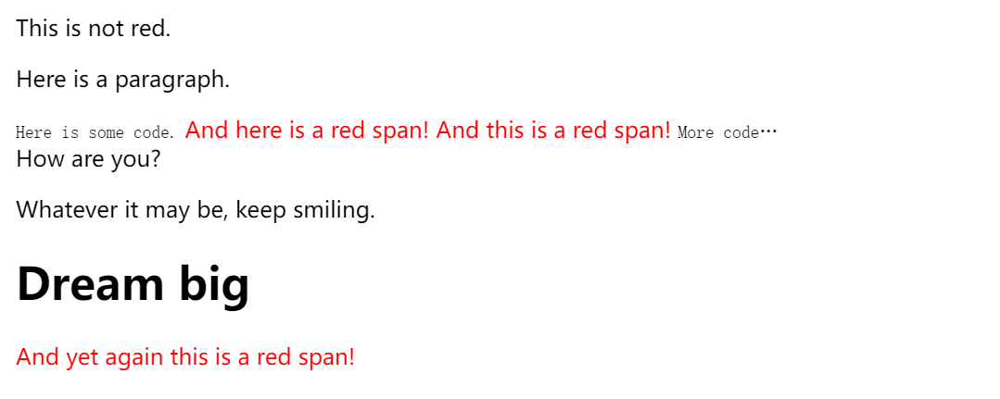

---

### 接续兄弟组合器

>`+` 组合器选择相邻元素，即后一个元素紧跟在前一个之后，并且共享同一个父节点。
>
> 语法：`A + B`
>
> 例子：`h2 + p` 会匹配紧邻在 h2 元素后的第一个 `<p>` 元素。

接续兄弟选择器（`+`）介于两个选择器之间，当第二个元素紧跟在第一个元素之后，并且两个元素都是属于同一个父元素的子元素，则第二个元素将被选中。

```CSS
/* 图片后面紧跟着的段落将被选中 */
img + p {
  font-weight: bold;
}
```

#### 接续兄弟组合器语法

```CSS
former_element + target_element { style properties }
```

#### 接续兄弟组合器示例

```CSS
li:first-of-type + li {
  color: red;
}
```

```HTML
<ul>
  <li>One</li>
  <li>Two!</li>
  <li>Three</li>
</ul>
```

#### 接续兄弟组合器结果

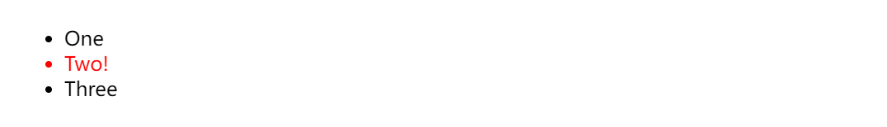

---

### 列组合器(所有游览器未实现)

> `||` 组合器选择属于某个表格行的节点。
>
>语法：`A || B`
>
>例子：`col || td` 会匹配所有 `<col>` 作用域内的 `<td>` (en-US) 元素。

提示
> !! **实验性: 这是一项实验性技术  
在将其用于生产之前，请仔细检查浏览器兼容性表格。**

通过列合并符 (`||`) 链接两个元素时，它只会匹配被第二个 CSS 选择器匹配的元素，且此元素属于被第一个 CSS 选择器匹配的列元素。

```CSS
/* 属于"被选择"列的表单元格 */
col.selected||td {
  background: gray;
}
```

#### 列组合器语法

```text
column-selector || cell-selector {
  /* style properties */
}
```

#### 列组合器示例

```HTML
<table border="1">
  <colgroup>
    <col span="2" />
    <col class="selected" />
  </colgroup>
  <tbody>
    <tr>
      <td>A</td>
      <td>B</td>
      <td>C</td>
    </tr>
    <tr>
      <td colspan="2">D</td>
      <td>E</td>
    </tr>
    <tr>
      <td>F</td>
      <td colspan="2">G</td>
    </tr>
  </tbody>
</table>
```

```CSS
col.selected||td {
  background: gray;
  color: white;
  font-weight: bold;
}
```

#### 列组合器结果

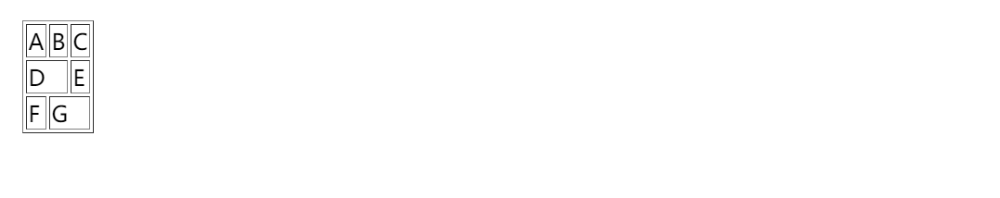

---

## 伪选择器 `:`（Pseudo）

CSS 伪类是添加到选择器的关键字，用于指定所选元素的特殊状态。例如，伪类 `:hover` 可以用于选择一个按钮，当用户的指针悬停在按钮上时，设置此按钮的样式。

```CSS
/* 用户的指针悬停在其上的任何按钮 */
button:hover {
  color: blue;
}
```

伪类由冒号（`:`）后跟着伪类名称组成（例如，`:hover`）。函数式伪类还包含一对括号来定义参数（例如，`:dir()`）。附上了伪类的元素被定义为锚元素（例如，`button:hover` 中的 `button`）。

伪类让你可以将样式应用于元素，不仅与文档树内容有关，也与外部因素有关——如与导航历史有关的（例如，`:visited`）、与其内容的状态有关的（如某些表单元素上的 `:checked`）或者与鼠标位置有关的（如 `:hover`，它可以让你知道鼠标是否在一个元素上）。

> 备注： 相较于伪类，伪元素可用于设置元素特定部分的样式。

### 元素显示状态伪类

这些伪类可以基于元素的显示状态来选择它们。

`:fullscreen`
匹配当前处于全屏模式的元素。

### 输入状态伪类

这些伪类与表单元素相关，可以基于 HTML 属性或交互前后字段的状态来选择元素。

TBD

### 语言的伪类

这些伪类根据文档语言而反应，可以基于语言或书写方向来选择元素。

`:dir()`
方向性伪类基于由文档语言所确定的其方向性来选择元素。

`:lang()`
基于其内容语言来选择元素。

### 位置伪类

这些伪类与链接以及当前文档中的目标元素有关。

TBD

### 资源状态伪类

这些伪类应用于能够处于被描述为“正在播放”状态的媒体，例如视频。

TBD

### 时间方面的伪类

这些伪类适用于查看有计时功能的东西，如 WebVTT 字幕轨。

TBD

### 树结构的伪类

这些伪类与文档树中的元素位置有关。

`:root`
表示文档的根元素。在 HTML 中这通常是 `<html>` 元素。

`:empty`
表示除空白字符外没有子元素的元素。

TBD

### 用户行为伪类

这些伪类需要用户进行一些交互才能够应用，例如将鼠标指针悬停在元素上。

TBD

### 函数式伪类

这些伪类接受可容错选择器列表作为参数。

`:is()`
匹配与提供的列表中的任何选择器匹配的任何元素。

`:not()`
表示其参数中未表示的任何元素。

`:where()`
优先级调整伪类匹配与提供的列表中的任何选择器匹配的任何元素，但不添加任何优先级权重。

`:has()`
该关系伪类表示与任何一个与锚定的元素的相对选择器相匹配（如果有的话）的元素。

### 伪类语法

```CSS
selector:pseudo-class {
  property: value;
}
```

像常规的类一样，你可以在选择器中将任意数量的伪类链在一起。

---

## 伪元素

伪元素是一个附加至选择器末的关键词，允许你对被选择元素的特定部分修改样式。下例中的 `::first-line` 伪元素可改变段落首行文字的样式。

```CSS
/* 每一个 <p> 元素的第一行。 */
p::first-line {
  color: blue;
  text-transform: uppercase;
}
```

备注： 与伪元素比较，`pseudo-classes` 能够根据状态改变元素样式。

语法

```CSS
selector::pseudo-element {
  property: value;
}
```

一个选择器中只能使用一个伪元素。伪元素必须紧跟在语句中的简单选择器/基础选择器之后。

备注： 按照规范，应该使用双冒号（`::`）而不是单个冒号（:），以便区分伪类和伪元素。但是，由于旧版本的 W3C 规范并未对此进行特别区分，因此目前绝大多数的浏览器都同时支持使用这两种方式来表示伪元素。
