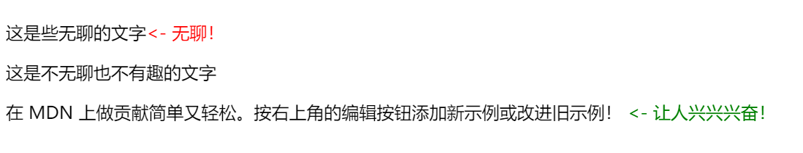
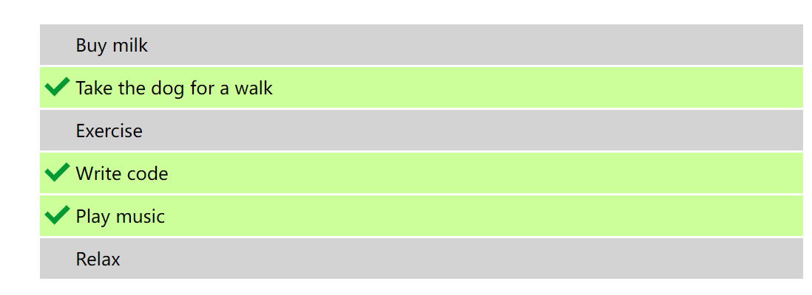
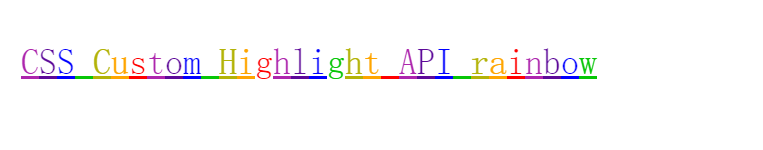
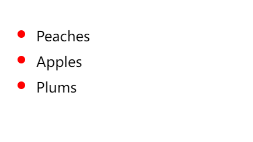
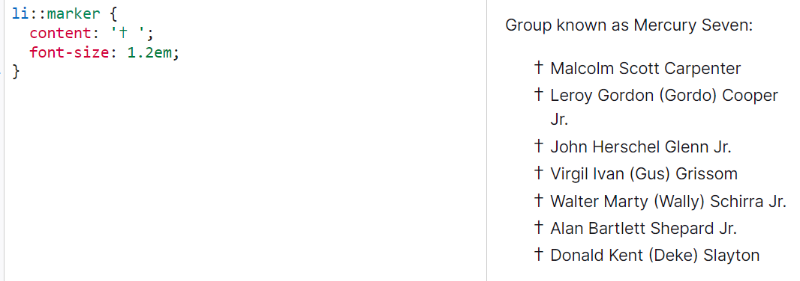
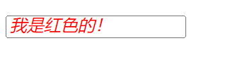
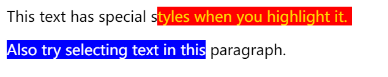

# CSS选择器-伪元素

> 2024年1月19日17:05:15

选择器 |描述
--|--
[`::after`](#after)|匹配出现在原有元素的实际内容之后的一个可样式化元素。
[`::before`](#before) |匹配出现在原有元素的实际内容之前的一个可样式化元素。
[`::file-selector-button`](#file-selector-button)|代表 `type="file"` 的 `<input>` 的按钮。
[`::first-letter`](#first-letter)| 匹配元素的第一个字母。
[`::first-line`](#first-line)| 匹配包含此伪元素的元素的第一行。
`::grammar-error`| 匹配文档中包含了浏览器标记的语法错误的那部分。!!主流游览器不支持
[`::highlight()`](#highlight)|自定义高亮
[`::marker`](#marker)|它作用在任何设置了 `display: list-item` 的元素或伪元素上，例如 `<li>` 和 `<summary>` 元素。可修改`<li>`的样式。
[`::part()`](<https://developer.mozilla.org/zh-CN/docs/Web/CSS/::part>)|表示在阴影树中任何匹配 part 属性的元素。
[`::placeholder`](#placeholder)|可以选择一个表单元素的**占位文本**，它允许开发者和设计师*自定义*占位文本的样式。**类似水印**。
[`::selection`](#selection) |匹配文档中被选择的那部分。（比如使用鼠标或其他选择设备选中的部分）
`::spelling-error`| 匹配文档中包含了浏览器标记的拼写错误的那部分。

---

## ::after

简单用法

```HTML
<p class="boring-text">这是些无聊的文字</p>
<p>这是不无聊也不有趣的文字</p>
<p class="exciting-text">
  在 MDN 上做贡献简单又轻松。按右上角的编辑按钮添加新示例或改进旧示例！
</p>
```

```CSS
.exciting-text::after {
  content: "<- 让人兴兴兴奋！";
  color: green;
}

.boring-text::after {
  content: "<- 无聊！";
  color: red;
}
```

结果


## ::before

简单用法，同 `::after` 这个是在元素前边添加。

HTML

```HTML
<ul>
  <li>Buy milk</li>
  <li>Take the dog for a walk</li>
  <li>Exercise</li>
  <li>Write code</li>
  <li>Play music</li>
  <li>Relax</li>
</ul>
```

CSS

```CSS
li {
  list-style-type: none;
  position: relative;
  margin: 2px;
  padding: 0.5em 0.5em 0.5em 2em;
  background: lightgrey;
  font-family: sans-serif;
}

li.done {
  background: #ccff99;
}

li.done::before {
  content: "";
  position: absolute;
  border-color: #009933;
  border-style: solid;
  border-width: 0 0.3em 0.25em 0;
  height: 1em;
  top: 1.3em;
  left: 0.6em;
  margin-top: -1em;
  transform: rotate(45deg);
  width: 0.5em;
}
```

JavaScript

```JavaScript
var list = document.querySelector("ul");
list.addEventListener(
  "click",
  function (ev) {
    if (ev.target.tagName === "LI") {
      ev.target.classList.toggle("done");
    }
  },
  false,
);
```

结果
下面展示的是最终得到的结果。请注意我们没有使用任何图标，对勾标识实际上是使用 CSS 定义了样式的`::before`伪元素。接下来建立几个待办事项来完成它们吧。
点击后


## ::file-selector-button

代表 `type="file"` 的 `<input>` 的按钮。

```css
input::file-selector-button {
  font-weight: bold;
  color: dodgerblue;
  padding: 0.5em;
  border: thin solid grey;
  border-radius: 3px;
}
或
input[type="file"]::file-selector-button:hover {
  background-color: #81ecec;
  border: 2px solid #00cec9;
}

```

## ::first-letter

选中（块级元素）第一行的第一个字母，并且文字所处的行之前没有其他内容（如图片和内联的表格）。

```css
p::first-letter {
  font-size: 130%;
}
```

- 首字符之前或紧跟首字符的标点符号在伪元素匹配范围内。标点符号（Punctuation）包括在开（`Ps`），闭（`Pe`），初始引用（`Pi`），结束引用（`Pf`）当中定义的任何 `Unicode` 字符以及其他种类的标点符号（`Po`）。
- 另外还会有一些以大写双字母组合命名的语言，比如荷兰的 IJ. 在这种罕见情况下，两个大写字母都理应被 `::first-letter` 伪元素匹配到。(但是浏览器对此支持得很糟糕，可以用浏览器兼容性表格进行核实).
- `::before` 伪元素 和 `content` 属性结合起来有可能会在元素前面注入一些文本。如此，`::first-letter` 将会匹配到 `content` 文本的首字母。

**首行只在 `block-container box`内部才有意义**，因此 `::first-letter` 伪元素 只在`display`属性值为 `block`, `inline-block`, `table-cell`, `list-item` 或者 `table-caption`的元素上才起作用。其他情况下，`::first-letter` 毫无意义。

## ::first-line

选中（块级元素）的第一行应用样式。第一行的长度取决于很多因素，包括元素宽度，文档宽度和文本的文字大小。

**允许的属性值**
在一个使用了 ::first-line 伪元素的选择器中，只有很小的一部分 css 属性能被使用：

所有和字体有关的属性：`font`, `font-kerning`, `font-style`, `font-variant`, `font-variant-numeric`, `font-variant-position`, `font-variant-east-asian`, `font-variant-caps`, `font-variant-alternates`, `font-variant-ligatures`, `font-synthesis`, `font-feature-settings`, `font-language-override`, `font-weight`, `font-size`, `font-size-adjust`, `font-stretch`, and `font-family`
`color`
所有和背景有关的属性： `background-color`, `background-clip`, `background-image`, `background-origin`, `background-position`, `background-repeat`, `background-size`, `background-attachment`, and `background-blend-mode`
`word-spacing`, `letter-spacing`, `text-decoration`, `text-transform`, and `line-height`
`text-shadow`, `text-decoration`, `text-decoration-color`, `text-decoration-line`, `text-decoration-style`, and `vertical-align`.

HTML

```HTML
<p>
  Lorem ipsum dolor sit amet, consectetur adipisicing elit, 
  sed do eiusmod  tempor incididunt ut labore.
</p>
```

CSS

```CSS
p::first-line {
  text-transform: uppercase;
}
```

输出

```text
LORUM IPSUM DOLOR SIT AMET, CONSECTETUDO ADIPISICING ELIT, 
sed do eiusmod tempor incididunt ut labore.
```

## ::highlight()

将样式应用于自定义高亮显示。

**允许的属性值**。

- `color`
- `background-color`
- `text-decoration` and its associated properties
- `text-shadow`
- `-webkit-text-stroke-color`, `-webkit-text-fill-color` and `-webkit-text-stroke-width`

HTML

```HTML
<p id="rainbow-text">CSS Custom Highlight API rainbow</p>
```

CSS

```CSS
#rainbow-text {
  font-family: monospace;
  font-size: 1.5rem;
}

::highlight(rainbow-color-1) {
  color: #ad26ad;
  text-decoration: underline;
}
::highlight(rainbow-color-2) {
  color: #5d0a99;
  text-decoration: underline;
}
::highlight(rainbow-color-3) {
  color: #0000ff;
  text-decoration: underline;
}
::highlight(rainbow-color-4) {
  color: #07c607;
  text-decoration: underline;
}
::highlight(rainbow-color-5) {
  color: #b3b308;
  text-decoration: underline;
}
::highlight(rainbow-color-6) {
  color: #ffa500;
  text-decoration: underline;
}
::highlight(rainbow-color-7) {
  color: #ff0000;
  text-decoration: underline;
}
```

JavaScript

```JS
const textNode = document.getElementById("rainbow-text").firstChild;

if (!CSS.highlights) {
  textNode.textContent =
    "The CSS Custom Highlight API is not supported in this browser!";
}

// Create and register highlights for each color in the rainbow.
const highlights = [];
for (let i = 0; i < 7; i++) {
  // Create a new highlight for this color.
  const colorHighlight = new Highlight();
  highlights.push(colorHighlight);

  // Register this highlight under a custom name.
  CSS.highlights.set(`rainbow-color-${i + 1}`, colorHighlight);
}

// Iterate over the text, character by character.
for (let i = 0; i < textNode.textContent.length; i++) {
  // Create a new range just for this character.
  const range = new Range();
  range.setStart(textNode, i);
  range.setEnd(textNode, i + 1);

  // Add the range to the next available highlight,
  // looping back to the first one once we've reached the 7th.
  highlights[i % 7].add(range);
}
```

结果



## ::marker

允许的属性值
在将 ::marker 作为选择器的规则中，只能使用某些 CSS 属性：

- 所有的字体属性
- white-space 属性
- color 属性
- text-combine-upright (en-US)、unicode-bidi 和 direction 属性
- content 属性
- 所有的 animation 和 transition 属性

HTML

```html
<ul>
  <li>Peaches</li>
  <li>Apples</li>
  <li>Plums</li>
</ul>
```

CSS

```CSS
ul li::marker {
  color: red;
  font-size: 1.5em;
}
```

结果



HTML

```html
<p>Group known as Mercury Seven:</p>
<ul>
  <li>Malcolm Scott Carpenter</li>
  <li>Leroy Gordon (Gordo) Cooper Jr.</li>
  <li>John Herschel Glenn Jr.</li>
  <li>Virgil Ivan (Gus) Grissom</li>
  <li>Walter Marty (Wally) Schirra Jr.</li>
  <li>Alan Bartlett Shepard Jr.</li>
  <li>Donald Kent (Deke) Slayton</li>
</ul>
```

CSS

```css
li::marker {
  content: '✝ ';
  font-size: 1.2em;
}
```

结果


## ::placeholder

**::placeholder**可以选择一个表单元素的占位文本 ，它允许开发者和设计师自定义占位文本 的样式。

HTML

```HTML
<input placeholder="我是红色的！" />
```

CSS

```CSS
input::placeholder {
  color: red;
  font-size: 1.2em;
  font-style: italic;
}
```



## ::selection

允许属性

- color
- background-color
- cursor
- caret-color
- outline and its longhands
- text-decoration and its associated properties
- text-emphasis-color (en-US)
- text-shadow

HTML

```HTML
This text has special styles when you highlight it.
<p>Also try selecting text in this paragraph.</p>
```

CSS

```CSS
Play
Copy to Clipboard
::-moz-selection {
  color: gold;
  background-color: red;
}

p::-moz-selection {
  color: white;
  background-color: blue;
}
CSS
Play
Copy to Clipboard
/* 选中的文本是红色背景，金黄色的字体 */
::selection {
  color: gold;
  background-color: red;
}

/*选中的是蓝色背景，白色的字体的段落*/
p::selection {
  color: white;
  background-color: blue;
}
```

结果

