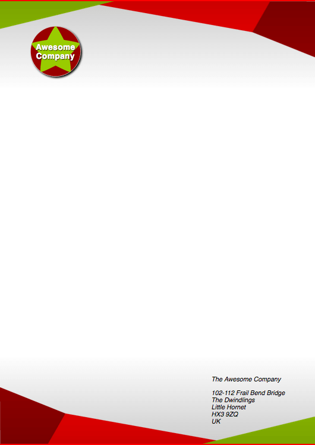

# 项目简介

你已经有了创建一个信纸模版所需的所有文件，只需把它们放到一起就好。为了达到目标，你需要：

## 信纸主体

- 把 CSS 链接到 HTML 文档里。
- 给信纸添加这样一个背景：
  - 把之前下载的顶部图片固定到信纸顶部。
  - 把之前下载的底部图片固定到信纸底部。
  - 为了给信纸一点纹理，在前面背景的基础上添加一个半透明的渐变，使其在顶部和底部附近稍微变暗，但中间的大部分完全透明。
- 多添加一个background声明，仅添加顶部图片到信纸顶部，以此作为不支持之前那种声明方式的浏览器的后备方案。
- 给信纸添加一个白色的背景颜色。
- 给信纸添加一个 1mm 的上下实线边框，选一个符合信纸的颜色主题的边框颜色。

## 标志

- 把之前下载的标志图片添加为`<h1>` (en-US)的背景图片。
- 给标志添加一个过滤器，使它有一个隐隐约约的阴影。
- 现在把添加的过滤器注释掉，尝试用其他（更跨浏览器兼容）的方式实现一个相同的阴影，阴影需要同样符合圆形图片的形状。

## 提示和技巧

- 记住，你可以这样为较旧的浏览器创建一个后备方案：先写一个较旧的浏览器支持的后备声明，然后再接着写只有较新的浏览器才支持的声明。这样比较旧的浏览器会应用第一个声明而忽略掉第二个不支持的声明，与此同时比较新的浏览器会先应用第一个声明，然后用第二个声明把它覆盖掉。
- 如果想的话你可以随意地用自己的图片来做这个评估。

## 范例

完成之后的信纸可能会像下面的截图这样：

## 相关资料

[06-背景与边框.md](../../06-背景与边框.md)
[06.1-背景色渐变.md](../../06.1-背景色渐变.md)
[06.2-阴影.md](../../06.2-阴影.md)
