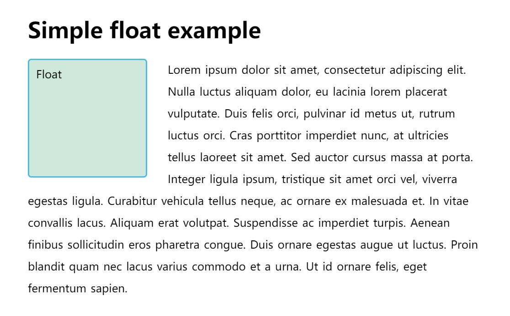

# 介绍CSS布局

## 正常布局流

浏览器默认的 HTML 布局方式

HTML 元素完全按照源码中出现的先后次序显示——第一个段落、无序列表、第二个段落。
出现在另一个元素下面的元素被描述为**块元素**，与出现在另一个元素旁边的**内联元素**不同，内联元素就像段落中的单个单词一样。

```html
<p>I love my cat.</p>

<ul>
  <li>Buy cat food</li>
  <li>Exercise</li>
  <li>Cheer up friend</li>
</ul>

<p>The end!</p>
```

下列布局技术会覆盖默认的布局行为：

- `display` 属性 — 标准的 value，比如`block`, `inline` 或者 `inline-block` 元素在正常布局流中的表现形式. 接着是全新的布局方式，通过设置`display`的值，比如 CSS Grid 和 Flexbox.
- 浮动——应用 `float` 值，诸如 `left` 能够让块级元素互相并排成一行，而不是一个堆叠在另一个上面。
- `position` 属性 — 允许你精准设置盒子中的盒子的位置，正常布局流中，默认为 `static` ，使用其他值会引起元素不同的布局方式，例如将元素固定到浏览器视口的左上角。
- 表格布局— 表格的布局方式可以用在非表格内容上，可以使用`display: table`和相关属性在非表元素上使用。
- 多列布局— 这个 Multi-column layout 属性可以让块按列布局，比如报纸的内容就是一列一列排布的。

## display属性

在 css 中实现页面布局的主要方法是设定display属性的值。

正常流中的所有内容都有一个display的值，用作元素的默认行为方式。

除了可以通过将一些内容从`block`转换为`inline`（反之亦然）来更改默认表示形式之外，还有一些更大的布局方法以`display`值开始。但是，在使用这些属性时，通常需要调用其他属性。在讨论布局时，对我们来说最重要的两个值是 `display: flex` 和 `display: grid`。

## 弹性盒子-flex

Flexbox 是 CSS 弹性盒子布局模块（Flexible Box Layout Module）的缩写，它被专门设计出来用于创建横向或是纵向的一维页面布局。要使用 flexbox，你只需要在想要进行 flex 布局的父元素上应用`display: flex` ，所有直接子元素都将会按照 flex 进行布局。

### 设置 display:flex

下面这些 HTML 标记描述了一个 class 为wrapper的容器元素，它的内部有三个`<div>`元素。它们在我们的英文文档当中，会默认地作为块元素从上到下进行显示。

现在，当我们把`display: flex`添加到它的父元素时，这三个元素就自动按列进行排列。这是由于它们变成了flex 项 (flex items)，按照 flex 容器（也就是它们的父元素）的一些 flex 相关的初值进行 flex 布局：**它们整整齐齐排成一行，是因为父元素上`flex-direction`的初值是`row`**。**它们全都被拉伸至和最高的元素高度相同，是因为父元素上`align-items`属性的初值是`stretch`**。这就意味着所有的子元素都会被拉伸到它们的 flex 容器的高度，在这个案例里就是所有 flex 项中最高的一项。所有项目都从容器的开始位置进行排列，排列成一行后，在尾部留下一片空白。

```CSS
.wrapper {
  display: flex;
}
```

```HTML
<div class="wrapper">
  <div class="box1">One</div>
  <div class="box2">Two</div>
  <div class="box3">Three</div>
</div>
```

### 设置 flex 属性

除了上述可以被应用到 flex 容器的属性以外，还有很多属性可以被应用到 flex 项 (flex items) 上面。这些属性可以改变 flex 项在 flex 布局中占用宽/高的方式，允许它们通过伸缩来适应可用空间。

作为一个简单的例子，我们可以在我们的所有子元素上添加flex 属性，并赋值为1，这会使得所有的子元素都伸展并填充容器，而不是在尾部留下空白，如果有更多空间，那么子元素们就会变得更宽，反之，他们就会变得更窄。除此之外，如果你在 HTML 标记中添加了一个新元素，那么它们也会变得更小，来为新元素创造空间——不管怎样，最终它们会调整自己直到占用相同宽度的空间。

```CSS
.wrapper {
  display: flex;
}

.wrapper > div {
  flex: 1;
}
```

```HTML
<div class="wrapper">
  <div class="box1">One</div>
  <div class="box2">Two</div>
  <div class="box3">Three</div>
</div>
```

## 网格-Grid 布局

Flexbox 用于设计横向或纵向的布局，而 Grid 布局则被设计用于同时在两个维度上把元素按行和列排列整齐。

### 设置 display: grid

同 flex 一样，你可以通过指定 display 的值来转到 grid 布局：`display: grid`。下面的例子使用了与 flex 例子类似的 HTML 标记，描述了一个容器和若干子元素。除了使用`display:grid`，我们还分别使用 `grid-template-rows` 和 `grid-template-columns` 两个属性定义了一些行和列的轨道。定义了三个`1fr`的列，还有两个`100px`的行之后，无需再在子元素上指定任何规则，它们自动地排列到了我们创建的格子当中。

```CSS
.wrapper {
  display: grid;
  grid-template-columns: 1fr 1fr 1fr;
  grid-template-rows: 100px 100px;
  grid-gap: 10px;
}
```

```HTML
<div class="wrapper">
  <div class="box1">One</div>
  <div class="box2">Two</div>
  <div class="box3">Three</div>
  <div class="box4">Four</div>
  <div class="box5">Five</div>
  <div class="box6">Six</div>
</div>
```


### 在网格内放置元素

一旦你拥有了一个 grid，你也可以显式地将元素摆放在里面，而不是依赖于浏览器进行自动排列。在下面的第二个例子里，我们定义了一个和上面一样的 grid，但是这一次我们只有三个子元素。我们利用 grid-column 和 grid-row 两个属性来指定每一个子元素应该从哪一行/列开始，并在哪一行/列结束。这就能够让子元素在多个行/列上展开。

```CSS
.wrapper {
  display: grid;
  grid-template-columns: 1fr 1fr 1fr;
  grid-template-rows: 100px 100px;
  grid-gap: 10px;
}

.box1 {
  grid-column: 2 / 4;
  grid-row: 1;
}

.box2 {
  grid-column: 1;
  grid-row: 1 / 3;
}

.box3 {
  grid-row: 2;
  grid-column: 3;
}
```

```HTML
<div class="wrapper">
  <div class="box1">One</div>
  <div class="box2">Two</div>
  <div class="box3">Three</div>
</div>
```

备注： 这两个例子只是展示了 grid 布局的冰山一角，要深入了解 grid 布局，请参阅我们的文章Grid Layout。

这篇指南的其余部分介绍了其他的布局方式，它们与你的页面的主要布局结构关系不大，但是却能够帮助你实现特殊的操作。同时，只要你理解了每一个布局任务的初衷，你就能够马上意识到哪一种布局更适合你的组件。


## 浮动

把一个元素“浮动”(float) 起来，会改变该元素本身和在正常布局流（normal flow）中跟随它的其他元素的行为。这一元素会浮动到左侧或右侧，并且从正常布局流 (normal flow) 中移除，这时候其他的周围内容就会在这个被设置浮动 (float) 的元素周围环绕。

float 属性有四个可能的值：

- left — 将元素浮动到左侧。
- right — 将元素浮动到右侧。
- none — 默认值，不浮动。
- inherit — 继承父元素的浮动属性。
-

在下面这个例子当中，我们把一个`<div>`元素浮动到左侧，并且给了他一个右侧的margin，把文字推开。这给了我们文字环绕着这个`<div>`元素的效果，在现代网页设计当中，这是你唯一需要学会的事情。

```css
.box {
  float: left;
  width: 150px;
  height: 150px;
  margin-right: 30px;
}
```



## 定位

定位 (positioning) 能够让我们把一个元素从它原本在正常布局流 (normal flow) 中应该在的位置移动到另一个位置。定位 (positioning) 并不是一种用来给你做主要页面布局的方式，它更像是让你去管理和微调页面中的一个特殊项的位置。

有一些非常有用的技术在特定的布局下依赖于`position`属性。同时，理解定位 (positioning) 也能够帮助你理解正常布局流 (normal flow)，理解把一个元素移出正常布局流 (normal flow) 是怎么一回事。

有五种主要的定位类型需要我们了解：

- **静态定位**（Static positioning）是每个元素默认的属性——它表示“将元素放在文档布局流的默认位置——没有什么特殊的地方”。
- **相对定位**（Relative positioning）允许我们相对于元素在正常的文档流中的位置移动它——包括将两个元素叠放在页面上。这对于微调和精准设计（design pinpointing）非常有用。
- **绝对定位**（Absolute positioning）将元素完全从页面的正常布局流（normal layout flow）中移出，类似将它单独放在一个图层中。我们可以将元素相对于页面的 <html> 元素边缘固定，或者相对于该元素的最近被定位祖先元素（nearest positioned ancestor element）。绝对定位在创建复杂布局效果时非常有用，例如通过标签显示和隐藏的内容面板或者通过按钮控制滑动到屏幕中的信息面板。
- **固定定位**（Fixed positioning）与绝对定位非常类似，但是它是将一个元素相对浏览器视口固定，而不是相对另外一个元素。这在创建类似在整个页面滚动过程中总是处于屏幕的某个位置的导航菜单时非常有用。
- **粘性定位**（Sticky positioning）是一种新的定位方式，它会让元素先保持和 position: static 一样的定位，当它的相对视口位置（offset from the viewport）达到某一个预设值时，它就会像 position: fixed 一样定位。

简单定位示例
我们将展示一些示例代码来熟悉这些布局技术。这些示例代码都作用在下面这一个相同的 HTML 上：

## CSS 表格布局

## 多列布局
