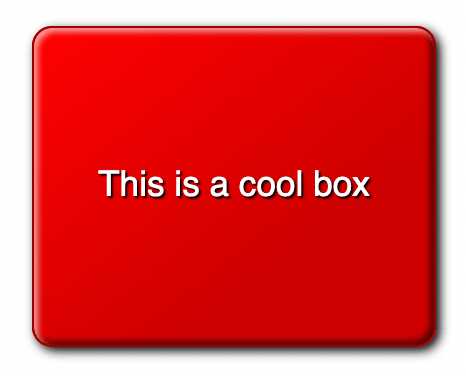

# 项目简介

你的任务是创建一个酷炫的盒子，并探索 CSS 的乐趣。

## 一般任务

把 CSS 链接到 HTML 里。

## 样式化盒子

给 `
` 添加样式：

- 一个对于大按钮来说合理的宽度，200 像素左右。
- 一个对于大按钮来说合理的高度，并使文本纵向居中。
- 居中文本。
- 用 rem 使字体稍大一点，大约 17-18 像素，在注释里说说你的值是怎么算出来的。
- 给你的设计定一个基础颜色，把它作为盒子的背景颜色。
- 把字体颜色设为同一个颜色，使用黑色的文字阴影增加可读性。
- 一个精巧的圆角边框。
- 一个跟基础颜色相近、1 像素宽的实线边框，颜色要稍深一点。
- 一个指向右下角的黑色半透明线性渐变，让它在开始的时候完全透明，在30% 的处渐变到 0.2 的不透明度，然后保持相同颜色到最后。
- 多个盒阴影：一个标准的盒阴影，使它看起来稍微从页面上浮起来；另外两个是内嵌（inset）的盒阴影，一个是左上角附近的白色半透明阴影和另一个是右下角附近的黑色半透明阴影，让盒子有一个漂亮的 3D 外观。

## 范例

完成之后的盒子可能会像下面的截图这样：

