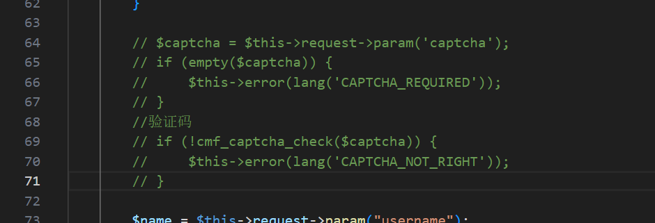
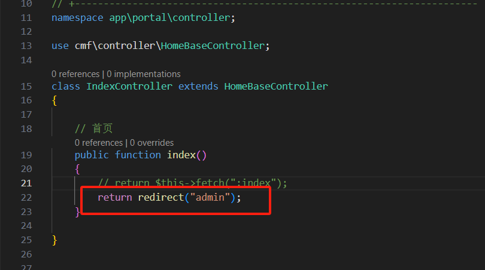

# 优化

## 去掉登录时的验证码

> E:\xampp\htdocs\thinkcmf8\vendor\thinkcmf\cmf-app\src\admin\controller\PublicController.php



## 游览器localhost 默认是后台首页

正常打开是区分前台和后台的，因项目不适用前台网站，所以默认后台登录页面

E:\xampp\htdocs\thinkcmf8\vendor\thinkcmf\cmf-app\src\portal\controller\IndexController.php



## 显示后台菜单

去cmf_admin_menu数据库 把后台菜单的 status设置成1

```sql
UPDATE `thinkcmf`.`cmf_admin_menu` SET `status` = 1 WHERE `id` = 20;
UPDATE `thinkcmf`.`cmf_admin_menu` SET `status` = 1 WHERE `id` = 21;
```

## 开启调试模式

把 .example.env 前缀去掉，改成 .env 文件名，才生效。
