# xampp同时启动两个版本php项目

> 本人csdn文章 <https://blog.csdn.net/RatherI/article/details/135591256>

## 引用资料

> [Xampp配置多网站项目](https://blog.berfen.com/36.html)
> [有没有办法在XAMPP中使用两个PHP版本？](https://007.gangguana.com/a/6d492eabfda5d1ac83575cc889df3e41.shtml)

## 前期准备

xampp 版本为 v3.3.0

php版本为 php8(xampp v3.3.0) 和 php7(xampp v3.2.4中获取的)

两个需要不同版本的项目

本文只介绍如何配置不同的php版本的项目 同时启动。

## 项目地址

项目1：thinkcmf8 使用xampp v3.3.0 自带的php8 版本
项目2：tk999 使用从 xampp v3.2.4 中的php7 版本 以前的项目

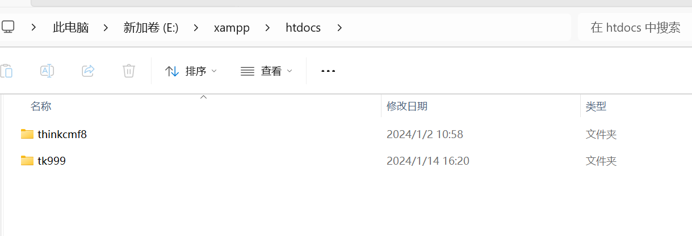

## 配置hosts

文件地址： **C:\Windows\System32\drivers\etc**

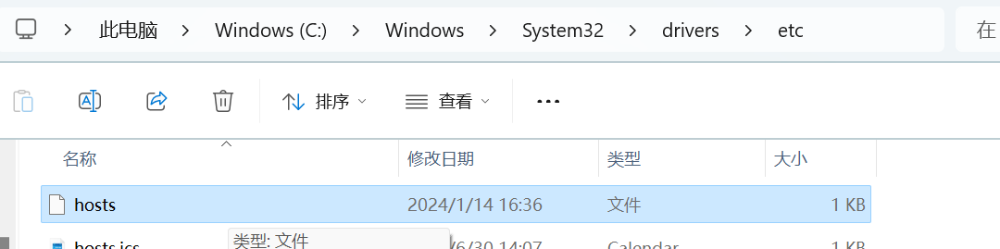

添加代码

```txt
127.0.0.1  www.cmf8.com
127.0.0.1  www.tk999.com
```

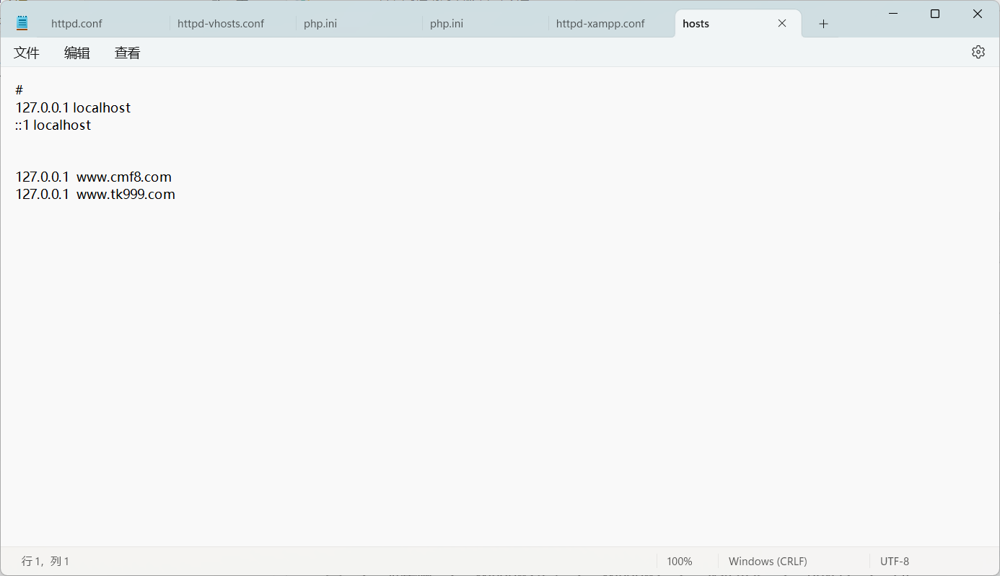

## 下载不同版本的php

php 为自带的 php8
php7 为原 v3.2.4拷贝出来的php 改的名

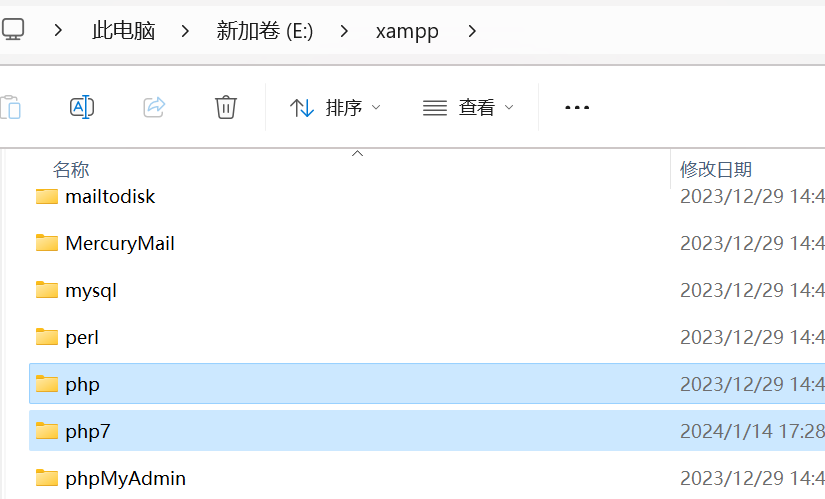

需要修改php7中的 php.ini 文件中的地址
所有原来的地址为当前目录地址 如 原：C:\xampp\php7\ext 改为 E:\xampp\php7\ext
php8的不用动，因为默认安装的时候就是E盘。

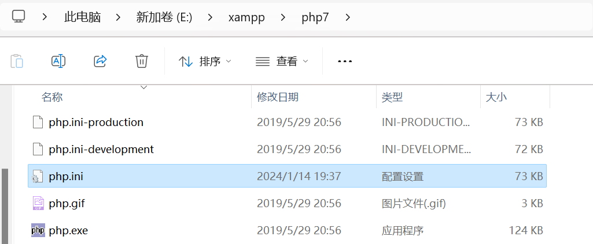
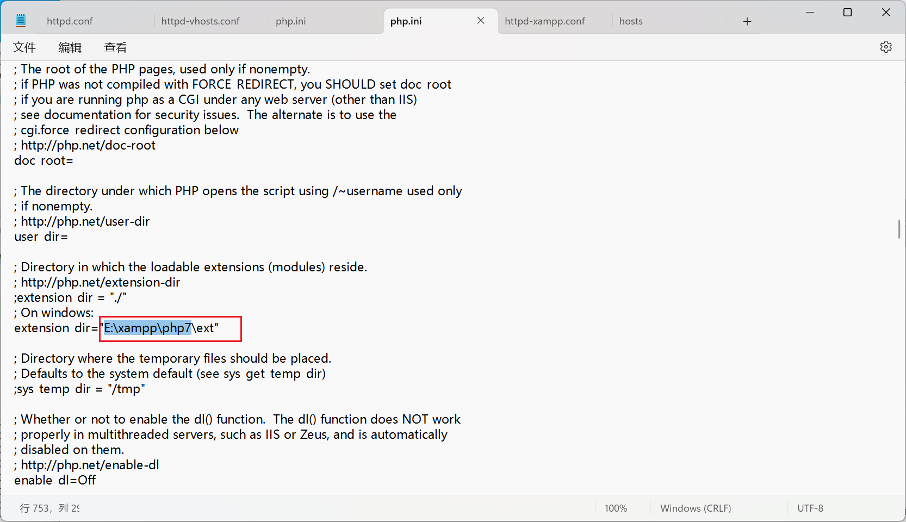

## 配置XAMPP

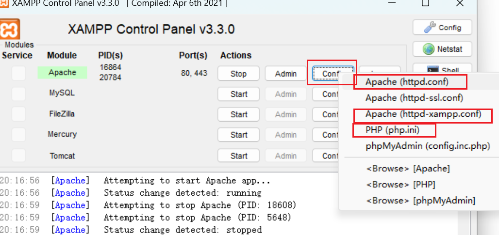

### 配置 httpd.conf

好像不需要配置啥

注意一下

```txt
DocumentRoot "E:/xampp/htdocs"
<Directory "E:/xampp/htdocs">
```

### 配置 http-vhosts.conf

路径：E:\xampp\apache\conf\extra

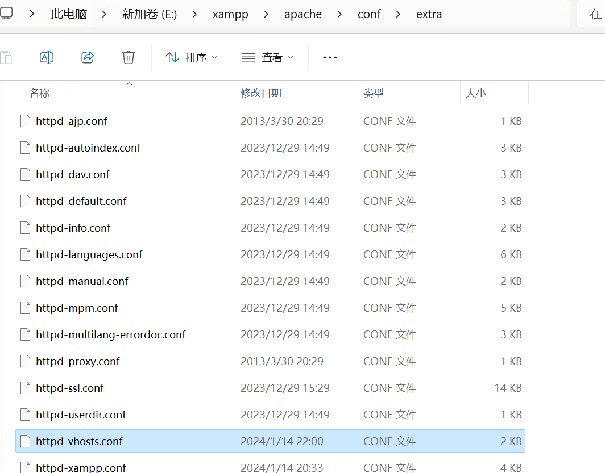

取消 `NameVirtualHost *:80` 前面的 ##

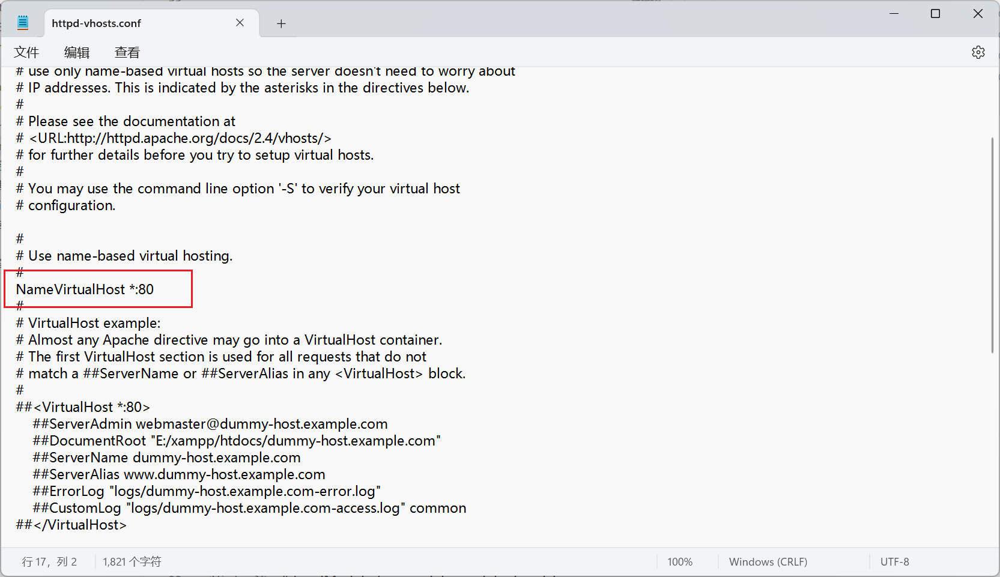

最下方添加

```txt
<VirtualHost *:80>
    DocumentRoot "E:/xampp/htdocs/"
    ServerName localhost
</VirtualHost>

<VirtualHost *:80>
    DocumentRoot "E:/xampp/htdocs/thinkcmf8/public"
    ServerName www.cmf8.com
</VirtualHost>

<VirtualHost *:80>
    DocumentRoot "E:/xampp/htdocs/tk999"
    ServerName www.tk999.com
</VirtualHost>
```

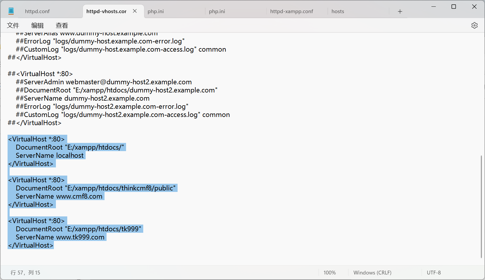

### 配置 httpd-xammp-conf

最下方 添加

```txt
ScriptAlias /php7 "E:/xampp/php7"
Action application/x-httpd-php7-cgi /php7/php-cgi.exe
<Directory "E:/xampp/php7">
    AllowOverride None
    Options None
    Require all denied
    <Files "php-cgi.exe">
        Require all granted
    </Files>
</Directory>

<Directory "E:\xampp\htdocs\tk999">
    <FilesMatch "\.php$">
        SetHandler application/x-httpd-php7-cgi
    </FilesMatch>
</Directory>

<Directory "E:\xampp\htdocs\cmf8">
    <FilesMatch "\.php$">
        SetHandler application/x-httpd-php-cgi
    </FilesMatch>
</Directory>
```

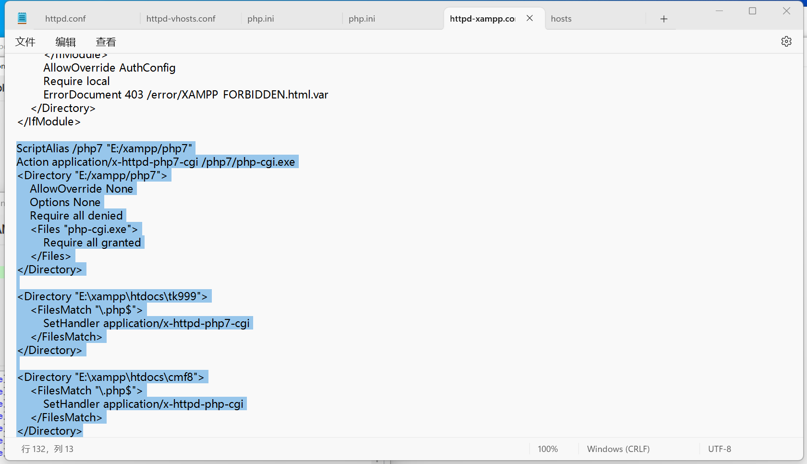
