# 快捷键

## 基本

### 上下文操作

`Alt + Enter` | 显示上下文操作 ，提示建议

### 搜索

查找: `Ctrl + Shift + A`
随处搜索: `两次 Shift`
搜索类: `Ctrl + N`
预览搜索的类: `Ctrl + Q`

#### 在文件中查找并替换

`ctrl + shift + f`
`ctrl + shift + r`

只在本页面有效
alt + w 缩小范围，全字符检索
alt + d 目录
alt + m 模块

#### 最近打开的文件

最近打开的文件： `ctrl + e`

最近打开的文件的代码位置： `ctrl + shift + e`

## 编辑器基本

### 选中

选中光标处的单词、整个字符串、包含引号的字符串、整个调用： `Ctrl + w`
`ctrl + shift + w` 缩小范围

### 上一个/下一个匹配项

选中字符串： `F3`
上一个：`shift + F3`

### 多选

选中同一个单词： `alt + j` ，可多次
取消上一个： `alt + shift + j`
选中所有的： `ctrl + alt + shift + j`
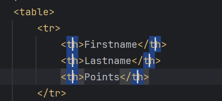

### 注释

// : `ctrl + /`
/*...*/ : `ctrl + shift + /`

### 复制和删除行

复制： `ctrl + d`
删除： `ctrl + y`

### 移动

移动一行： `alt + shift + ↑`
移动整个方法： 光标放到方法名所在行的任意位置 `ctrl + shift + ↑`

### 收起

`ctrl + 减号`

收起所有的 `ctrl + shift + 减号`

### 包围和解包

比如 给某个代码添加 try catch 或者加 if 判断

选中代码块 按 `ctrl + alt + t`

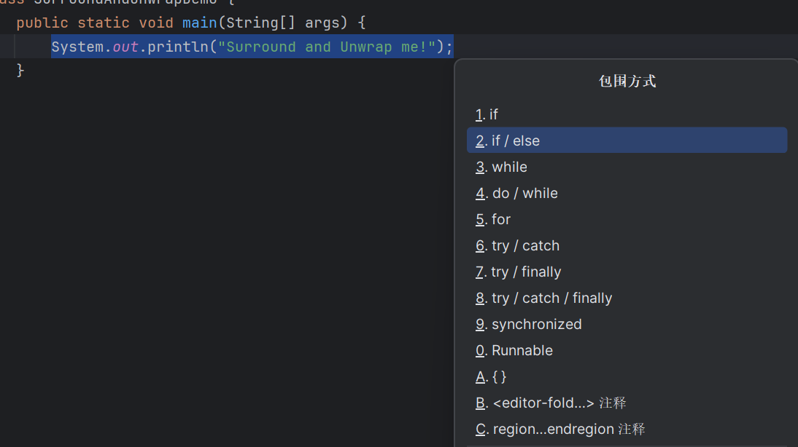

解包
选中代码块 按 `ctrl + shift + del`
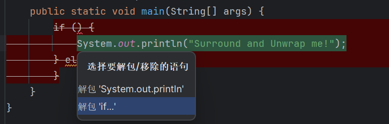

## 代码补全

激活补全： `Ctrl + 空格`

类型匹配补全： `ctrl + shift + 空格`

后缀补全 ： `.`

语句补全，并应用格式： `Ctrl + Shift + Enter`

使用tab补全： 按 `ctrl + 空格` 后，继续输入部分字符 按 `tab`

## 重构

### 重命名

`shift + F6` 改完后 回车，会自动检测相关的命名，并重命名。

### 提取变量

`ctrl + alt + v`

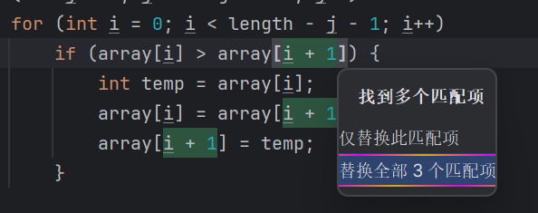
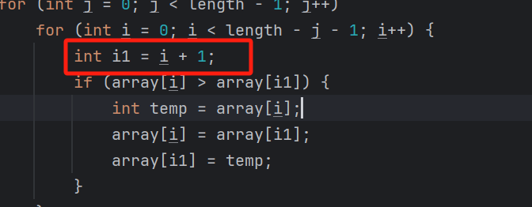

### 提取方法

`ctrl + alt + m`

把某段代码，提出去来单独形成一个方法。 同提取变量

### 重构菜单

`ctrl + alt + shift + t`

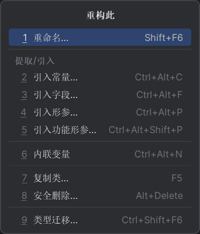

#### 引入形参

选中要传进来的代码块 `ctrl + alt + shift + t`  选择引入形参,选择推荐命名或者自定义命名
或者直接用 `ctrl + alt + p`

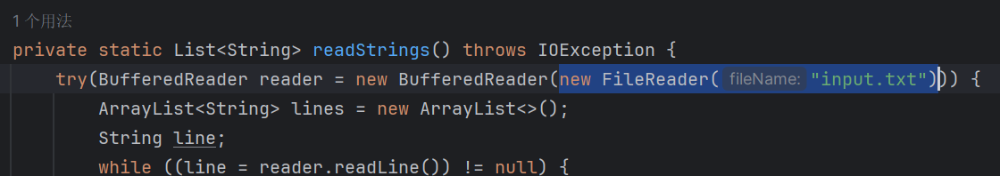
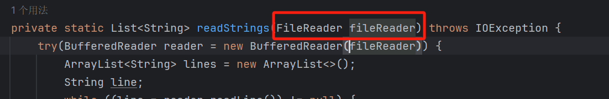

#### 内联变量

`ctrl + alt + n`

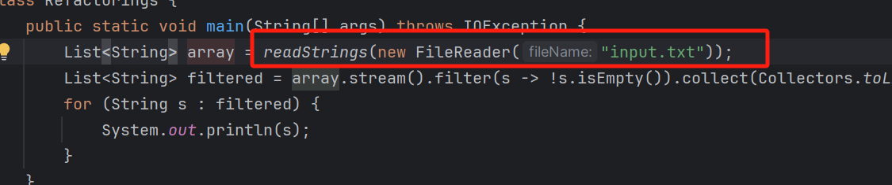
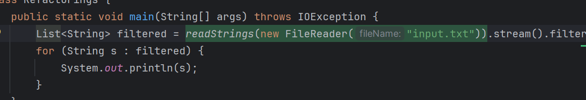

#### 引入常量

`ctrl + alt + c`

选中txt

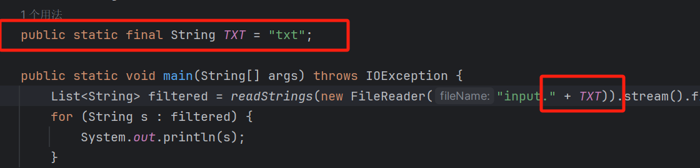

## 代码辅助

### 还原移除的代码

在文件任意位置，右键，选择
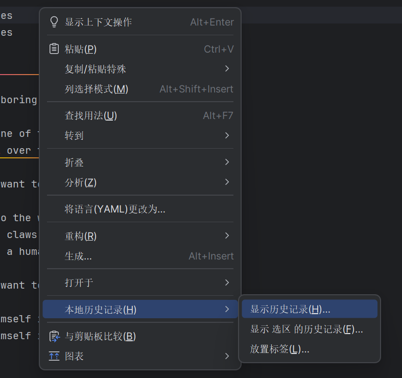
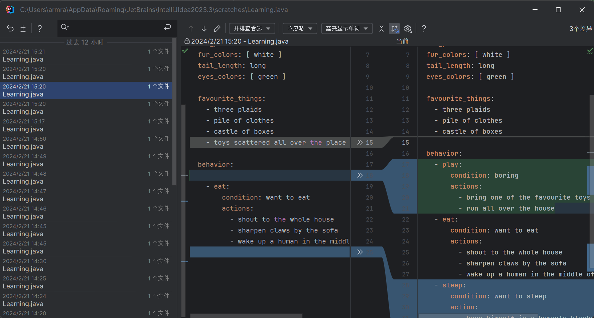

### 代码格式

代码格式化： `ctrl alt + l`

显示重新格式化设置，选择优化部位： `crtl + alt + shift + l`

### 形参信息

`ctrl + p`

会提示填写内容。
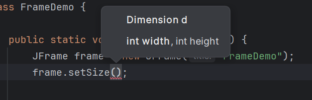

### 快速弹出窗口

`ctrl + q`

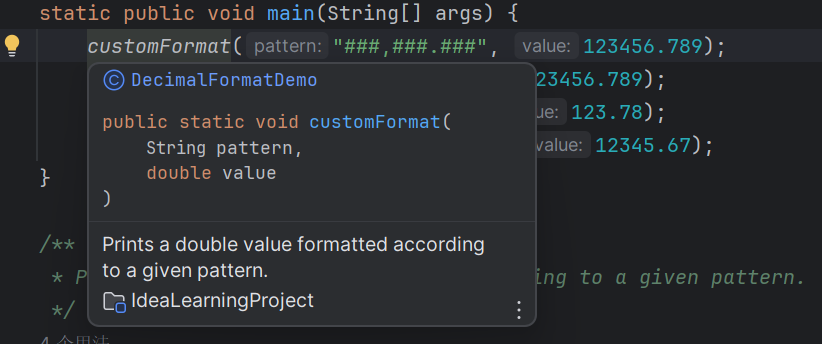

### 光标处符号定义

`ctrl + shift + i`

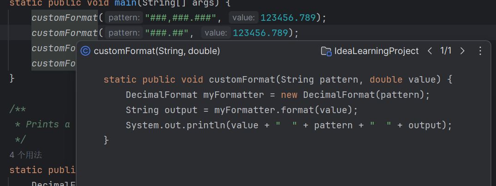

### 编辑器编码辅助

`F2` 快速定位到高亮显示的错误。 `alt + enter` 快速修复问题

`ctrl + F1` 展开警告说明。

### 文件结构

查看源代码 按 `ctrl + F12` ，搜到后定位  `alt + 7`

### 声明和用法

跳转到方法声明： `ctrl + b` = `ctrl + 鼠标左键`
可以查看其所有用法： `ctrl + b`

`alt + F7` 可以查看更详细的用法。

隐藏视图： `shift + Esc`
显示视图： `alt + 3`

### 继承层次结构

查找实现： ctrl + alt + b
派生到上一级： ctrl + u
